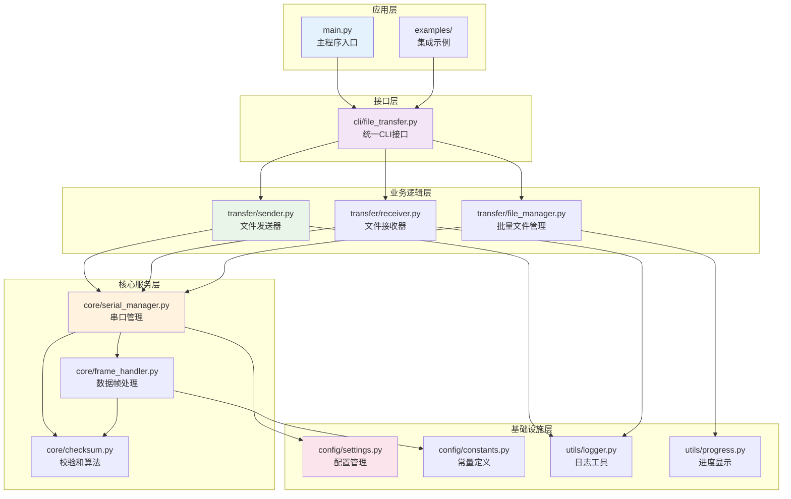
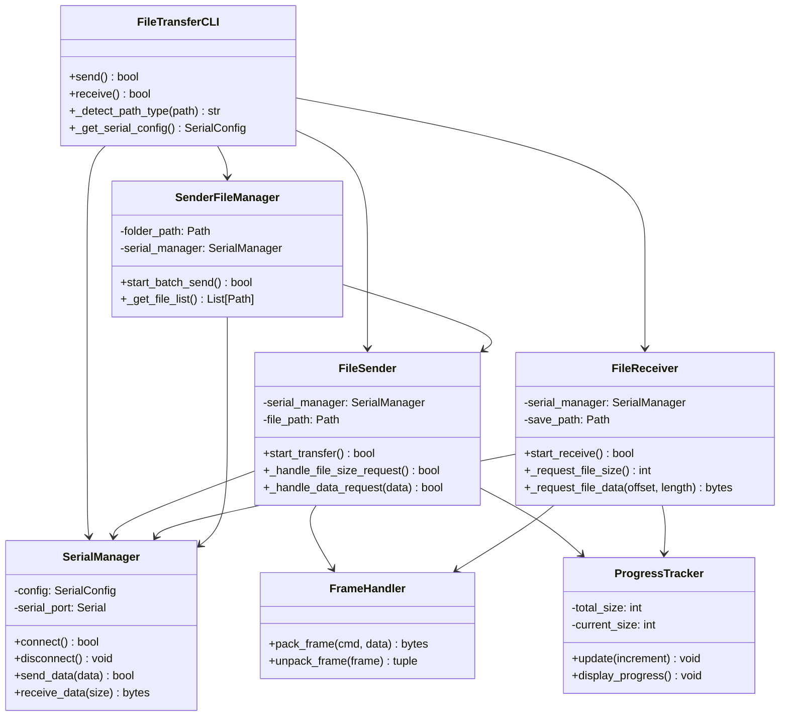
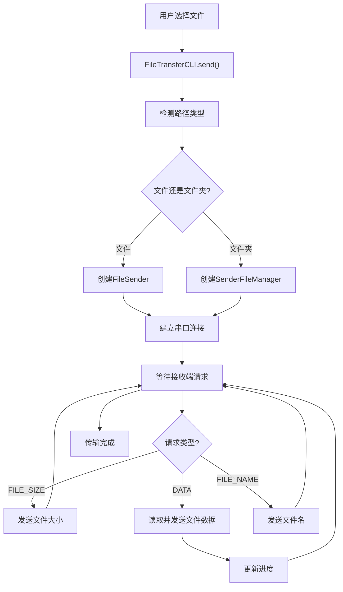
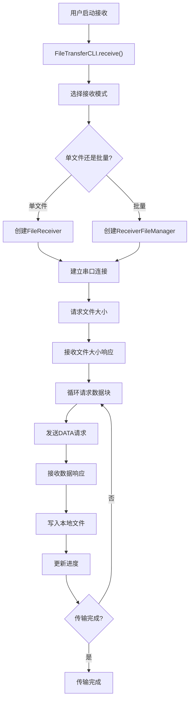

 # 串口文件传输工具 - 技术架构文档

## 文档概述

本文档详细介绍串口文件传输工具的技术架构，包括项目结构设计、核心模块功能、关键类和接口等。适合开发者深入了解系统内部实现。

**目标读者**: 技术开发者、架构师、代码贡献者  
**版本**: v1.3.1  
**最后更新**: 2024年12月  

---

## 设计原则

### 核心设计理念

1. **统一接口设计**: 智能路径检测，自动选择传输方式
2. **模块化架构**: 清晰的分层设计，便于维护和扩展
3. **可靠传输**: 采用校验和验证和错误重传机制
4. **类型安全**: 全面使用Python类型提示
5. **测试驱动**: 197个测试用例的完整测试体系

### 分层架构设计



---

## 项目结构详解

### 完整目录结构

```text
串口文件发送接收文件/
├── src/serial_file_transfer/           # 核心代码包
│   ├── __init__.py                     # 包初始化，版本信息
│   ├── config/                         # 配置管理模块
│   │   ├── __init__.py                 # 配置模块导出
│   │   ├── constants.py                # 协议常量定义
│   │   └── settings.py                 # 配置类定义
│   ├── core/                           # 核心功能模块
│   │   ├── __init__.py                 # 核心模块导出
│   │   ├── checksum.py                 # 校验和算法实现
│   │   ├── frame_handler.py            # 数据帧处理逻辑
│   │   └── serial_manager.py           # 串口管理器
│   ├── transfer/                       # 传输逻辑模块
│   │   ├── __init__.py                 # 传输模块导出
│   │   ├── sender.py                   # 单文件发送器
│   │   ├── receiver.py                 # 单文件接收器
│   │   └── file_manager.py             # 批量文件管理器
│   ├── utils/                          # 工具函数模块
│   │   ├── __init__.py                 # 工具模块导出
│   │   ├── logger.py                   # 统一日志记录工具
│   │   └── progress.py                 # 传输进度显示工具
│   └── cli/                            # 命令行接口模块
│       ├── __init__.py                 # CLI模块导出
│       └── file_transfer.py            # 统一文件传输CLI
├── tests/                              # 测试代码 (138个测试用例)
│   ├── __init__.py                     # 测试包初始化
│   ├── README.md                       # 测试说明文档
│   ├── test_checksum.py                # 校验和算法测试 (18个用例)
│   ├── test_settings.py                # 配置管理测试 (21个用例)
│   ├── test_serial_manager.py          # 串口管理器测试 (28个用例)
│   ├── test_sender.py                  # 文件发送器测试 (23个用例)
│   ├── test_frame_handler.py           # 数据帧处理测试 (7个用例)
│   ├── test_file_transfer_cli.py       # CLI功能测试 (14个用例)
│   └── test_main.py                    # 主程序测试 (27个用例)
├── examples/                           # 代码集成示例
│   ├── README.md                       # 示例说明文档
│   ├── send_example.py                 # 发送功能集成示例
│   └── receive_example.py              # 接收功能集成示例
├── docs/                               # 项目文档
│   ├── README.md                       # 文档中心索引
│   ├── PROTOCOL.md                     # 协议规范文档
│   ├── USER_GUIDE.md                   # 用户操作指南
│   ├── ARCHITECTURE.md                 # 技术架构文档
│   ├── TESTING.md                      # 测试框架文档
│   └── DEVELOPMENT.md                  # 开发指南文档
├── main.py                             # 主程序入口
├── requirements.txt                    # 项目依赖管理
├── pytest.ini                         # 测试框架配置
├── README.md                          # 项目概览文档
└── .gitignore                         # Git忽略文件规则
```

### 目录职责说明

| 目录/文件 | 行数 | 职责描述 | 依赖关系 |
|----------|------|----------|----------|
| **src/serial_file_transfer/** | - | 核心代码包，包含所有功能模块 | - |
| **config/** | ~100 | 配置管理，常量定义，系统参数 | 被所有模块依赖 |
| **core/** | ~800 | 核心功能，串口通信，数据处理 | 依赖config，被transfer依赖 |
| **transfer/** | ~1200 | 传输逻辑，文件发送接收，批量处理 | 依赖core，被cli依赖 |
| **utils/** | ~200 | 工具函数，日志记录，进度显示 | 依赖config，被其他模块使用 |
| **cli/** | ~300 | 命令行接口，统一入口，用户交互 | 依赖transfer和utils |
| **tests/** | ~2000 | 测试代码，138个测试用例 | 测试所有模块 |
| **examples/** | ~100 | 集成示例，使用演示 | 依赖cli |
| **docs/** | ~1500 | 项目文档，技术说明 | 独立维护 |

---

## 核心模块详解

### 1. 配置管理模块 (config/)

#### constants.py - 协议常量定义

```python
class SerialCommand(IntEnum):
    """串口通信命令字枚举"""
    
    # 文件大小相关命令
    REQUEST_FILE_SIZE = 0x61    # 请求文件大小
    REPLY_FILE_SIZE = 0x62      # 回复文件大小
    
    # 数据传输相关命令  
    REQUEST_DATA = 0x63         # 请求数据包
    SEND_DATA = 0x64           # 发送数据包
    
    # 数据确认相关命令
    ACK = 0x65                # 数据包确认
    NACK = 0x66               # 请求重传
    
    # 文件名相关命令
    REQUEST_FILE_NAME = 0x51    # 请求文件名
    REPLY_FILE_NAME = 0x52      # 回复文件名

# 数据帧格式定义
FRAME_HEADER_FORMAT: Final[str] = "<BH"  # 命令字(1字节) + 数据长度(2字节)
FRAME_CRC_FORMAT: Final[str] = "<H"      # 校验和(2字节)

# 默认配置值
DEFAULT_BAUDRATE: Final[int] = 115200    # 默认波特率
DEFAULT_TIMEOUT: Final[float] = 0.1      # 默认超时时间
DEFAULT_MAX_DATA_LENGTH: Final[int] = 1024  # 默认最大数据长度
```

#### settings.py - 配置类定义

```python
@dataclass
class SerialConfig:
    """串口配置类"""
    port: str = ""                          # 串口号
    baudrate: int = DEFAULT_BAUDRATE        # 波特率
    timeout: float = DEFAULT_TIMEOUT       # 超时时间
    
    def validate(self) -> bool:
        """验证配置有效性"""
        return self.port and self.baudrate > 0

class TransferConfig:
    """传输配置类"""
    max_data_length: int = DEFAULT_MAX_DATA_LENGTH  # 最大数据长度
    request_timeout: int = DEFAULT_REQUEST_TIMEOUT  # 请求超时(秒)
    retry_count: int = DEFAULT_RETRY_COUNT          # 重试次数
    backoff_base: float = 0.5                       # 指数退避基础秒数
    max_cache_size: int = 4 * 1024 * 1024          # 触发流式读取阈值(4MB)
```

### 2. 核心功能模块 (core/)

#### serial_manager.py - 串口管理器

```python
class SerialManager:
    """串口连接管理器"""
    
    def __init__(self, config: SerialConfig):
        """初始化串口管理器"""
        self.config = config
        self.serial_port: Optional[serial.Serial] = None
        self.is_connected = False
    
    def __enter__(self) -> 'SerialManager':
        """上下文管理器入口"""
        self.connect()
        return self
    
    def __exit__(self, exc_type, exc_val, exc_tb):
        """上下文管理器出口"""
        self.disconnect()
    
    def connect(self) -> bool:
        """建立串口连接"""
        
    def disconnect(self) -> None:
        """断开串口连接"""
        
    def send_data(self, data: bytes) -> bool:
        """发送数据"""
        
    def receive_data(self, size: int) -> Optional[bytes]:
        """接收数据"""
```

**设计特点**:
- 上下文管理器支持，自动资源管理
- 连接状态管理和异常处理
- 统一的数据发送接收接口
- 支持动态配置和重连

#### frame_handler.py - 数据帧处理

```python
class FrameHandler:
    """数据帧打包和解包处理器"""
    
    @staticmethod
    def pack_frame(cmd: Union[SerialCommand, int], data: bytes = b"") -> bytes:
        """
        打包数据帧
        
        Args:
            cmd: 命令字
            data: 数据内容
            
        Returns:
            完整的数据帧
        """
        
    @staticmethod
    def unpack_frame(frame_data: bytes) -> Optional[Tuple[int, int, bytes, int]]:
        """
        解包数据帧
        
        Args:
            frame_data: 完整数据帧
            
        Returns:
            (命令字, 数据长度, 数据内容, 校验和) 或 None
        """
```

**设计特点**:
- 静态方法设计，无状态处理
- 完整的数据帧验证
- 校验和自动计算和验证
- 错误处理和异常安全

#### checksum.py - 校验和算法

```python
def calculate_checksum(data: bytes) -> int:
    """
    计算数据的简单校验和
    
    算法: 对所有字节求和后取模65536
    
    Args:
        data: 需要计算校验和的数据
        
    Returns:
        16位校验和值 (0-65535)
    """
    
def verify_checksum(data: bytes, expected_checksum: int) -> bool:
    """
    验证数据校验和
    
    Args:
        data: 原始数据
        expected_checksum: 期望的校验和值
        
    Returns:
        校验和是否正确
    """
```

### 3. 传输逻辑模块 (transfer/)

#### sender.py - 文件发送器

```python
class FileSender:
    """单文件发送器"""
    
    def __init__(self, 
                 serial_manager: SerialManager, 
                 file_path: Optional[Union[str, Path]] = None,
                 config: Optional[TransferConfig] = None):
        """初始化文件发送器"""
        
    def start_transfer(self) -> bool:
        """开始文件传输"""
        
    def _handle_file_size_request(self) -> bool:
        """处理文件大小请求"""
        
    def _handle_data_request(self, request_data: bytes) -> bool:
        """处理数据请求"""
        
    def _send_file_data(self, offset: int, length: int) -> bool:
        """发送文件数据块"""
```

#### receiver.py - 文件接收器

```python
class FileReceiver:
    """单文件接收器"""
    
    def __init__(self,
                 serial_manager: SerialManager,
                 save_path: Optional[Union[str, Path]] = None,
                 config: Optional[TransferConfig] = None):
        """初始化文件接收器"""
        
    def start_receive(self) -> bool:
        """开始文件接收"""
        
    def _request_file_size(self) -> Optional[int]:
        """请求文件大小"""
        
    def _request_file_data(self, offset: int, length: int) -> Optional[bytes]:
        """请求文件数据"""
        
    def _save_received_data(self, data: bytes) -> bool:
        """保存接收到的数据"""
```

#### file_manager.py - 批量文件管理

```python
class SenderFileManager:
    """发送端批量文件管理器"""
    
    def __init__(self,
                 folder_path: Union[str, Path],
                 serial_manager: SerialManager,
                 config: Optional[TransferConfig] = None):
        """初始化批量文件管理器"""
        
    def start_batch_send(self) -> bool:
        """开始批量文件发送"""
        
    def _get_file_list(self) -> List[Path]:
        """获取待发送文件列表"""
        
    def _send_file_name(self, file_name: str) -> bool:
        """发送文件名"""

class ReceiverFileManager:
    """接收端批量文件管理器"""
    
    def start_batch_receive(self) -> bool:
        """开始批量文件接收"""
        
    def _request_next_file_name(self) -> Optional[str]:
        """请求下一个文件名"""
```

### 4. 工具函数模块 (utils/)

#### logger.py - 日志工具

```python
def setup_logger(name: str, level: int = logging.INFO) -> logging.Logger:
    """
    设置日志记录器
    
    Args:
        name: 日志记录器名称
        level: 日志级别
        
    Returns:
        配置好的日志记录器
    """
    
def get_logger(name: str) -> logging.Logger:
    """获取日志记录器"""
    
# 预配置的日志记录器
transfer_logger = get_logger("transfer")
serial_logger = get_logger("serial")
frame_logger = get_logger("frame")
```

#### progress.py - 进度显示

```python
class ProgressTracker:
    """传输进度跟踪器"""
    
    def __init__(self, total_size: int, description: str = "传输进度"):
        """初始化进度跟踪器"""
        self.total_size = total_size
        self.current_size = 0
        self.description = description
        self.start_time = time.time()
    
    def update(self, increment: int) -> None:
        """更新进度"""
        
    def get_progress_info(self) -> Dict[str, Any]:
        """获取进度信息"""
        
    def display_progress(self) -> None:
        """显示进度条"""
```

### 5. 命令行接口模块 (cli/)

#### file_transfer.py - 统一CLI接口

```python
class FileTransferCLI:
    """文件传输命令行接口"""
    
    @staticmethod
    def send() -> bool:
        """发送文件或文件夹的统一入口"""
        # 1. 获取用户输入
        # 2. 检测路径类型
        # 3. 选择传输方式
        # 4. 执行传输
        
    @staticmethod
    def receive() -> bool:
        """接收文件的统一入口"""
        # 1. 获取用户配置
        # 2. 选择接收模式
        # 3. 开始接收
        
    @staticmethod
    def _detect_path_type(path: str) -> str:
        """检测路径类型"""
        
    @staticmethod
    def _get_serial_config() -> SerialConfig:
        """获取串口配置"""
        
    @staticmethod
    def _get_transfer_config() -> TransferConfig:
        """获取传输配置"""
```

---

## 核心类关系图



---

## 数据流设计

### 发送端数据流



### 接收端数据流



---

## 性能设计考量

### 内存使用优化

1. **流式处理**: 大文件分块读取，避免内存溢出
2. **缓冲管理**: 可配置的缓冲区大小，平衡性能和内存
3. **对象复用**: 重用SerialManager和FrameHandler实例

### 传输性能优化

1. **动态块大小**: 根据文件大小自动调整传输块大小
2. **并发处理**: 文件读取和数据传输的流水线处理
3. **错误重试**: 智能重试机制，减少不必要的重传

### 可扩展性设计

1. **插件架构**: 预留协议扩展接口
2. **配置驱动**: 通过配置文件控制行为
3. **模块解耦**: 清晰的模块边界，便于独立扩展

---

## 总结

本架构文档详细描述了串口文件传输工具的技术实现，主要特点：

✅ **模块化设计**: 5层清晰架构，职责分明  
✅ **统一接口**: CLI统一入口，自动路径检测  
✅ **类型安全**: 全面使用Python类型提示  
✅ **资源管理**: 上下文管理器确保资源正确释放  
✅ **错误处理**: 完善的异常处理和重试机制  
✅ **可扩展性**: 预留扩展接口，便于功能增强  

该架构支持从简单的单文件传输到复杂的批量传输场景，为串口文件传输提供了稳定可靠的技术基础。 