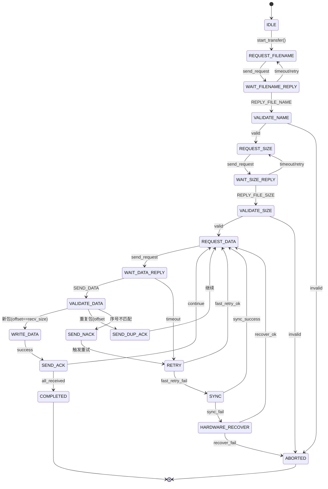

# 接收端状态机详细设计

**版本**: v2.0  
**创建日期**: 2025-10-01

## 一、状态定义

```python
class ReceiverState(IntEnum):
    """接收端状态枚举"""
    IDLE = 0                      # 空闲状态
    REQUEST_FILENAME = 1          # 请求文件名
    WAIT_FILENAME_REPLY = 2       # 等待文件名回复
    VALIDATE_NAME = 3             # 验证文件名
    REQUEST_SIZE = 4              # 请求文件大小
    WAIT_SIZE_REPLY = 5           # 等待文件大小回复
    VALIDATE_SIZE = 6             # 验证文件大小
    REQUEST_DATA = 7              # 请求数据
    WAIT_DATA_REPLY = 8           # 等待数据回复
    VALIDATE_DATA = 9             # 验证数据（检查重复帧）
    WRITE_DATA = 10               # 写入数据
    SEND_ACK = 11                 # 发送ACK
    SEND_DUP_ACK = 12             # 发送重复ACK（重复帧）
    SEND_NACK = 13                # 发送NACK
    RETRY = 14                    # 重试阶段
    SYNC = 15                     # 序号同步
    HARDWARE_RECOVER = 16         # 硬件恢复
    COMPLETED = 17                # 传输完成
    ABORTED = 18                  # 传输中止
```

## 二、状态转移图



## 三、状态详细说明

### 3.1 IDLE（空闲状态）

**描述**: 初始状态，等待开始传输

**输入事件**:
- `start_transfer(save_path)`: 开始传输

**转移条件**:
- 保存路径有效 → `REQUEST_FILENAME`
- 保存路径无效 → 保持 `IDLE`，返回错误

**内部动作**:
```python
def _handle_idle(self, event):
    if event.type == 'start_transfer':
        if self._validate_save_path(event.save_path):
            self.save_path = Path(event.save_path)
            self._transition_to(ReceiverState.REQUEST_FILENAME)
            return True
    return False
```

---

### 3.2 REQUEST_FILENAME（请求文件名）

**描述**: 发送文件名请求

**输出动作**:
- 发送 `REQUEST_FILE_NAME` 帧

**转移条件**:
- 发送成功 → `WAIT_FILENAME_REPLY`
- 发送失败 → `ABORTED`

**内部动作**:
```python
def _handle_request_filename(self):
    if self.send_filename_request():
        self._transition_to(ReceiverState.WAIT_FILENAME_REPLY)
        return True
    else:
        logger.error("发送文件名请求失败")
        self._transition_to(ReceiverState.ABORTED)
        return False
```

---

### 3.3 WAIT_FILENAME_REPLY（等待文件名回复）

**描述**: 等待发送端回复文件名

**输入事件**:
- `REPLY_FILE_NAME`: 收到文件名回复
- `timeout`: 超时

**超时设置**: `request_timeout` (默认30秒)

**转移条件**:
- 收到 `REPLY_FILE_NAME` → `VALIDATE_NAME`
- 超时 → `REQUEST_FILENAME`（重试）

**内部动作**:
```python
def _handle_wait_filename_reply(self):
    cmd, data = self._read_frame_with_timeout(self.config.request_timeout)
    
    if cmd == SerialCommand.REPLY_FILE_NAME:
        self._received_filename_data = data
        self._transition_to(ReceiverState.VALIDATE_NAME)
        return True
    elif cmd is None:
        logger.warning("等待文件名回复超时")
        self._filename_retry_count += 1
        if self._filename_retry_count < 3:
            self._transition_to(ReceiverState.REQUEST_FILENAME)
        else:
            self._transition_to(ReceiverState.ABORTED)
    
    return False
```

---

### 3.4 VALIDATE_NAME（验证文件名）

**描述**: 解析并验证文件名

**验证规则**:
- 长度有效（≤ 512字节）
- UTF-8解码成功
- 文件名不含非法字符

**转移条件**:
- 验证通过 → `REQUEST_SIZE`
- 验证失败 → `ABORTED`

**内部动作**:
```python
def _handle_validate_name(self):
    try:
        data = self._received_filename_data
        
        # 解析变长编码
        if len(data) < 2:
            raise ValueError("文件名数据长度不足")
        
        name_len = struct.unpack("<H", data[:2])[0]
        if len(data) < 2 + name_len:
            raise ValueError("文件名数据不完整")
        
        filename_bytes = data[2:2 + name_len]
        filename = filename_bytes.decode("utf-8")
        
        # 构建完整保存路径
        self.save_path = self.save_path / filename
        
        logger.info(f"接收到文件名: {filename}")
        self._transition_to(ReceiverState.REQUEST_SIZE)
        return True
        
    except Exception as e:
        logger.error(f"文件名验证失败: {e}")
        self._transition_to(ReceiverState.ABORTED)
        return False
```

---

### 3.5 REQUEST_SIZE（请求文件大小）

**描述**: 发送文件大小请求

**输出动作**:
- 发送 `REQUEST_FILE_SIZE` 帧

**转移条件**:
- 发送成功 → `WAIT_SIZE_REPLY`
- 发送失败 → `ABORTED`

---

### 3.6 WAIT_SIZE_REPLY（等待文件大小回复）

**描述**: 等待发送端回复文件大小

**输入事件**:
- `REPLY_FILE_SIZE`: 收到文件大小回复
- `timeout`: 超时

**超时设置**: `request_timeout` (默认30秒)

**转移条件**:
- 收到 `REPLY_FILE_SIZE` → `VALIDATE_SIZE`
- 超时 → `REQUEST_SIZE`（重试）

---

### 3.7 VALIDATE_SIZE（验证文件大小）

**描述**: 解析并验证文件大小

**验证规则**:
- 文件大小 > 0
- 磁盘空间足够

**转移条件**:
- 验证通过 → `REQUEST_DATA`（打开文件句柄）
- 验证失败 → `ABORTED`

**内部动作**:
```python
def _handle_validate_size(self):
    try:
        data = self._received_size_data
        self.file_size = struct.unpack("<I", data)[0]
        
        if self.file_size <= 0:
            raise ValueError("文件大小无效")
        
        # 检查磁盘空间（可选）
        # ...
        
        # 打开文件句柄
        self.save_path.parent.mkdir(parents=True, exist_ok=True)
        self._file_handle = self.save_path.open("wb")
        
        logger.info(f"文件大小: {self.file_size / 1024:.2f} KB")
        self._transition_to(ReceiverState.REQUEST_DATA)
        return True
        
    except Exception as e:
        logger.error(f"文件大小验证失败: {e}")
        self._transition_to(ReceiverState.ABORTED)
        return False
```

---

### 3.8 REQUEST_DATA（请求数据）

**描述**: 发送数据请求

**输出动作**:
- 计算请求地址和长度
- 发送 `REQUEST_DATA(addr, len)` 帧

**转移条件**:
- 发送成功 → `WAIT_DATA_REPLY`
- 所有数据已接收 → `COMPLETED`

**内部动作**:
```python
def _handle_request_data(self):
    # 检查是否传输完成
    if self.recv_size >= self.file_size:
        self._transition_to(ReceiverState.COMPLETED)
        return True
    
    # 计算请求参数
    addr = self.recv_size
    remain_len = self.file_size - self.recv_size
    length = min(remain_len, self.config.max_data_length)
    
    # 发送请求
    if self.send_data_request(addr, length):
        self._current_request_addr = addr
        self._current_request_len = length
        self._transition_to(ReceiverState.WAIT_DATA_REPLY)
        return True
    else:
        logger.error("发送数据请求失败")
        self._transition_to(ReceiverState.RETRY)
        return False
```

---

### 3.9 WAIT_DATA_REPLY（等待数据回复）

**描述**: 等待发送端回复数据

**输入事件**:
- `SEND_DATA`: 收到数据包
- `timeout`: 超时

**超时设置**: `data_timeout` (默认5秒)

**转移条件**:
- 收到 `SEND_DATA` → `VALIDATE_DATA`
- 超时 → `RETRY`

**内部动作**:
```python
def _handle_wait_data_reply(self):
    cmd, data = self._read_frame_with_timeout(self.config.data_timeout)
    
    if cmd == SerialCommand.SEND_DATA:
        self._received_data = data
        self._transition_to(ReceiverState.VALIDATE_DATA)
        return True
    elif cmd is None:
        logger.warning("等待数据回复超时")
        self._transition_to(ReceiverState.RETRY)
        return False
    else:
        logger.warning(f"收到非预期命令: {hex(cmd)}")
        return False
```

---

### 3.10 VALIDATE_DATA（验证数据）⭐核心逻辑

**描述**: 验证数据包，检查是否重复帧

**验证逻辑**:
```python
def _handle_validate_data(self):
    try:
        data = self._received_data
        
        # 解析新格式：seq(2) + offset(4) + payload
        if len(data) < 6:
            raise ValueError("数据包长度不足")
        
        seq_id = struct.unpack("<H", data[:2])[0]
        offset = struct.unpack("<I", data[2:6])[0]
        payload = data[6:]
        
        logger.debug(f"收到数据包: seq={seq_id} offset={offset} len={len(payload)}")
        
        # 判断是否重复帧
        if offset < self.recv_size:
            # 重复帧：已接收过的数据
            logger.warning(f"检测到重复帧: offset={offset} < recv_size={self.recv_size}")
            self._duplicate_frame_info = {'seq_id': seq_id, 'offset': offset}
            self._transition_to(ReceiverState.SEND_DUP_ACK)
            return True
        
        elif offset == self.recv_size:
            # 新包：期望的数据
            if seq_id == self._expected_seq:
                # 序号也匹配
                self._validated_payload = payload
                self._validated_seq = seq_id
                self._validated_offset = offset
                self._transition_to(ReceiverState.WRITE_DATA)
                return True
            else:
                # 序号不匹配（但偏移量正确）
                logger.warning(f"序号不匹配: seq={seq_id} != expected={self._expected_seq}")
                # 可以选择容忍（基于偏移量接受）或拒绝
                # 这里选择拒绝，触发序号同步
                self._nack_info = {'seq_id': seq_id, 'offset': offset}
                self._transition_to(ReceiverState.SEND_NACK)
                return False
        
        else:
            # 偏移量跳跃：数据丢失
            logger.error(f"偏移量跳跃: offset={offset} > recv_size={self.recv_size}")
            self._nack_info = {'seq_id': seq_id, 'offset': offset}
            self._transition_to(ReceiverState.SEND_NACK)
            return False
        
    except Exception as e:
        logger.error(f"数据验证失败: {e}")
        self._transition_to(ReceiverState.SEND_NACK)
        return False
```

**关键优化点**:
- ✅ **重复帧识别**: `offset < recv_size` 表示重复帧
- ✅ **幂等ACK**: 重复帧重发ACK但丢弃数据
- ✅ **偏移量优先**: 以 offset 为主判断，序号为辅

---

### 3.11 WRITE_DATA（写入数据）

**描述**: 写入数据到文件

**转移条件**:
- 写入成功 → `SEND_ACK`
- 写入失败 → `ABORTED`

**内部动作**:
```python
def _handle_write_data(self):
    try:
        payload = self._validated_payload
        offset = self._validated_offset
        
        # 写入文件
        if self._file_handle:
            self._file_handle.write(payload)
            self.recv_size += len(payload)
            
            logger.debug(f"写入数据: offset={offset} len={len(payload)} total={self.recv_size}")
            self._transition_to(ReceiverState.SEND_ACK)
            return True
        else:
            raise IOError("文件句柄无效")
        
    except Exception as e:
        logger.error(f"写入数据失败: {e}")
        self._transition_to(ReceiverState.ABORTED)
        return False
```

---

### 3.12 SEND_ACK（发送ACK）

**描述**: 发送ACK确认

**输出动作**:
- 打包 `ACK(seq, offset)` 帧
- 发送ACK
- 更新期望序号

**转移条件**:
- 发送成功 → `REQUEST_DATA`
- 所有数据已接收 → `COMPLETED`

**内部动作**:
```python
def _handle_send_ack(self):
    seq_id = self._validated_seq
    offset = self._validated_offset
    
    # 新格式：seq(2) + offset(4)
    ack_data = struct.pack("<HI", seq_id, offset)
    frame = FrameHandler.pack_frame(SerialCommand.ACK, ack_data)
    
    if frame and self.serial_manager.write(frame):
        # 更新期望序号
        self._expected_seq = (self._expected_seq + 1) & 0xFFFF
        
        logger.info(f"发送ACK: seq={seq_id} offset={offset}")
        
        # 检查是否传输完成
        if self.recv_size >= self.file_size:
            self._transition_to(ReceiverState.COMPLETED)
        else:
            self._transition_to(ReceiverState.REQUEST_DATA)
        
        return True
    else:
        logger.error("发送ACK失败")
        return False
```

---

### 3.13 SEND_DUP_ACK（发送重复ACK）⭐关键优化

**描述**: 对重复帧重发ACK（幂等确认）

**输出动作**:
- 打包 `ACK(seq, offset)` 帧
- 发送ACK（但不写入数据）

**转移条件**:
- 发送成功 → `REQUEST_DATA`（继续请求下一包）

**内部动作**:
```python
def _handle_send_dup_ack(self):
    info = self._duplicate_frame_info
    seq_id = info['seq_id']
    offset = info['offset']
    
    # 重发ACK
    ack_data = struct.pack("<HI", seq_id, offset)
    frame = FrameHandler.pack_frame(SerialCommand.ACK, ack_data)
    
    if frame and self.serial_manager.write(frame):
        logger.info(f"重发ACK（重复帧）: seq={seq_id} offset={offset}")
        self._transition_to(ReceiverState.REQUEST_DATA)
        return True
    else:
        logger.warning("重发ACK失败")
        return False
```

**关键优化点**:
- ✅ **幂等性**: 重复帧不影响传输进度
- ✅ **避免死锁**: 发送端收到ACK后停止重传

---

### 3.14 SEND_NACK（发送NACK）

**描述**: 发送NACK请求重传

**输出动作**:
- 打包 `NACK(seq, offset)` 帧
- 发送NACK

**转移条件**:
- 发送成功 → `RETRY`

**内部动作**:
```python
def _handle_send_nack(self):
    info = self._nack_info
    seq_id = info['seq_id']
    offset = info.get('offset', self.recv_size)
    
    # 新格式：seq(2) + offset(4)
    nack_data = struct.pack("<HI", seq_id, offset)
    frame = FrameHandler.pack_frame(SerialCommand.NACK, nack_data)
    
    if frame and self.serial_manager.write(frame):
        logger.warning(f"发送NACK: seq={seq_id} offset={offset}")
        self._transition_to(ReceiverState.RETRY)
        return True
    else:
        logger.error("发送NACK失败")
        return False
```

---

### 3.15 RETRY（重试阶段）

**描述**: 快速重试阶段

**重试策略**:
1. 快速重试（3次，间隔0.1秒）
2. 若失败 → 转入 `SYNC`

**内部动作**:
```python
def _handle_retry(self):
    self._retry_count += 1
    
    if self._retry_count <= 3:
        # 快速重试
        logger.info(f"快速重试 {self._retry_count}/3")
        time.sleep(0.1)
        self._transition_to(ReceiverState.REQUEST_DATA)
        return True
    else:
        # 转入同步阶段
        logger.warning("快速重试失败，触发序号同步")
        self._retry_count = 0
        self._transition_to(ReceiverState.SYNC)
        return False
```

---

### 3.16 SYNC（序号同步）

**描述**: 序号同步阶段

**同步策略**:
- 发送 `SYNC_REQUEST`（包含期望 seq 和当前 offset）
- 等待 `SYNC_REPLY`
- 根据回复调整序号

**转移条件**:
- 同步成功 → `REQUEST_DATA`
- 同步失败 → `HARDWARE_RECOVER`

**内部动作**:
```python
def _handle_sync(self):
    # 发送同步请求
    sync_data = struct.pack("<HI", self._expected_seq, self.recv_size)
    frame = FrameHandler.pack_frame(SerialCommand.SYNC_REQUEST, sync_data)
    
    if frame and self.serial_manager.write(frame):
        # 等待同步回复
        cmd, data = self._read_frame_with_timeout(self.config.sync_timeout)
        
        if cmd == SerialCommand.SYNC_REPLY:
            reply_seq, reply_offset, ack = struct.unpack("<HIH", data)
            
            # 调整序号
            self._expected_seq = reply_seq
            
            logger.info(f"序号同步成功: seq={reply_seq} offset={reply_offset}")
            self._transition_to(ReceiverState.REQUEST_DATA)
            return True
    
    logger.error("序号同步失败")
    self._transition_to(ReceiverState.HARDWARE_RECOVER)
    return False
```

---

### 3.17 HARDWARE_RECOVER（硬件恢复）

**描述**: 硬件恢复阶段

**恢复策略**:
1. 清理串口缓冲区
2. 延迟1秒
3. 保守重试（5次，间隔0.2秒）

**转移条件**:
- 恢复成功 → `REQUEST_DATA`
- 恢复失败 → `ABORTED`

---

### 3.18 COMPLETED（传输完成）

**描述**: 传输成功完成

**动作**:
- 关闭文件句柄
- 验证文件大小
- 记录统计信息

**内部动作**:
```python
def _handle_completed(self):
    # 关闭文件句柄
    if self._file_handle and not self._file_handle.closed:
        self._file_handle.close()
    
    # 验证文件大小
    actual_size = self.save_path.stat().st_size
    if actual_size != self.file_size:
        logger.error(f"文件大小不匹配: {actual_size} != {self.file_size}")
        self._transition_to(ReceiverState.ABORTED)
        return False
    
    logger.info(f"文件接收完成: {self.save_path}")
    return True
```

---

### 3.19 ABORTED（传输中止）

**描述**: 传输失败或被中止

**动作**:
- 关闭文件句柄
- 删除不完整文件
- 记录错误信息

**内部动作**:
```python
def _handle_aborted(self):
    # 关闭文件句柄
    if self._file_handle and not self._file_handle.closed:
        self._file_handle.close()
    
    # 删除不完整文件
    if self.save_path and self.save_path.exists():
        try:
            self.save_path.unlink()
            logger.info(f"已删除不完整文件: {self.save_path}")
        except OSError as e:
            logger.error(f"删除文件失败: {e}")
    
    logger.error("传输中止")
    return False
```

---

## 四、会话控制器设计

```python
class ReceiverSessionController:
    """接收端会话控制器"""
    
    def __init__(self, serial_manager, save_path, config):
        self.state = ReceiverState.IDLE
        self.serial_manager = serial_manager
        self.save_path = Path(save_path)
        self.config = config
        
        # 传输状态
        self._expected_seq = 0
        self.recv_size = 0
        self.file_size = 0
        
        # 文件句柄
        self._file_handle = None
        
        # 重试计数
        self._retry_count = 0
        self._filename_retry_count = 0
        
        # 临时数据
        self._received_data = None
        self._validated_payload = None
        self._validated_seq = 0
        self._validated_offset = 0
        self._duplicate_frame_info = {}
        self._nack_info = {}
    
    def _transition_to(self, new_state: ReceiverState):
        """状态转移"""
        logger.info(f"状态转移: {self.state.name} -> {new_state.name}")
        self.state = new_state
    
    def run(self):
        """状态机主循环"""
        handlers = {
            ReceiverState.IDLE: self._handle_idle,
            ReceiverState.REQUEST_FILENAME: self._handle_request_filename,
            ReceiverState.WAIT_FILENAME_REPLY: self._handle_wait_filename_reply,
            ReceiverState.VALIDATE_NAME: self._handle_validate_name,
            ReceiverState.REQUEST_SIZE: self._handle_request_size,
            ReceiverState.WAIT_SIZE_REPLY: self._handle_wait_size_reply,
            ReceiverState.VALIDATE_SIZE: self._handle_validate_size,
            ReceiverState.REQUEST_DATA: self._handle_request_data,
            ReceiverState.WAIT_DATA_REPLY: self._handle_wait_data_reply,
            ReceiverState.VALIDATE_DATA: self._handle_validate_data,
            ReceiverState.WRITE_DATA: self._handle_write_data,
            ReceiverState.SEND_ACK: self._handle_send_ack,
            ReceiverState.SEND_DUP_ACK: self._handle_send_dup_ack,
            ReceiverState.SEND_NACK: self._handle_send_nack,
            ReceiverState.RETRY: self._handle_retry,
            ReceiverState.SYNC: self._handle_sync,
            ReceiverState.HARDWARE_RECOVER: self._handle_hardware_recover,
        }
        
        while self.state not in [ReceiverState.COMPLETED, ReceiverState.ABORTED]:
            handler = handlers.get(self.state)
            if handler:
                handler()
            else:
                logger.error(f"未知状态: {self.state}")
                break
        
        # 最终处理
        if self.state == ReceiverState.COMPLETED:
            self._handle_completed()
            return True
        else:
            self._handle_aborted()
            return False
```

---

## 五、关键优化点

### 5.1 重复帧幂等处理⭐
```python
if offset < recv_size:
    # 重复帧：重发ACK，丢弃数据
    self._transition_to(ReceiverState.SEND_DUP_ACK)
```

### 5.2 偏移量优先验证
```python
if offset == recv_size and seq_id == expected_seq:
    # 完全匹配：接受数据
    pass
elif offset == recv_size:
    # 偏移量正确但序号不匹配：触发同步
    pass
else:
    # 偏移量错误：发送NACK
    pass
```

### 5.3 统一重试流程
- 快速重试（3次） → 序号同步 → 硬件恢复 → 中止

### 5.4 完整的状态验证
- 每个状态都有明确的输入/输出
- 每个转移都有日志记录
- 每个错误都有恢复路径

---

**文档结束**

