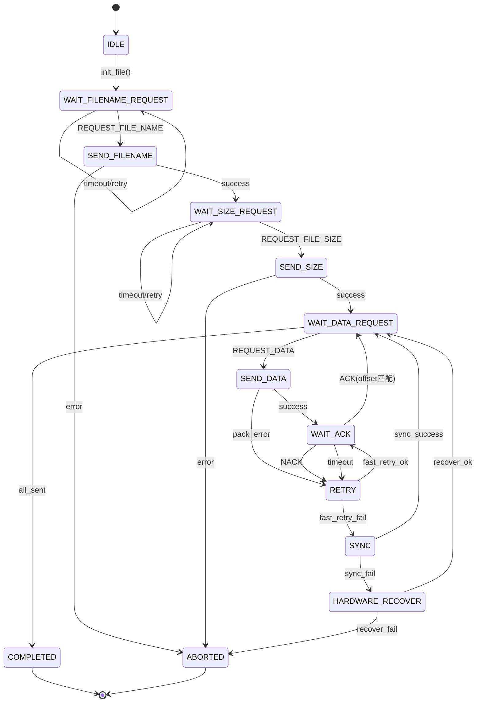

# 发送端状态机详细设计

**版本**: v2.0  
**创建日期**: 2025-10-01

## 一、状态定义

```python
class SenderState(IntEnum):
    """发送端状态枚举"""
    IDLE = 0                      # 空闲状态
    WAIT_FILENAME_REQUEST = 1     # 等待文件名请求
    SEND_FILENAME = 2             # 发送文件名
    WAIT_SIZE_REQUEST = 3         # 等待文件大小请求
    SEND_SIZE = 4                 # 发送文件大小
    WAIT_DATA_REQUEST = 5         # 等待数据请求
    SEND_DATA = 6                 # 发送数据包
    WAIT_ACK = 7                  # 等待ACK确认
    RETRY = 8                     # 重试阶段
    SYNC = 9                      # 序号同步
    HARDWARE_RECOVER = 10         # 硬件恢复
    COMPLETED = 11                # 传输完成
    ABORTED = 12                  # 传输中止
```

## 二、状态转移图



## 三、状态详细说明

### 3.1 IDLE（空闲状态）

**描述**: 初始状态，等待文件初始化

**输入事件**:
- `init_file(file_path)`: 初始化文件

**转移条件**:
- 文件加载成功 → `WAIT_FILENAME_REQUEST`
- 文件加载失败 → 保持 `IDLE`，返回错误

**内部动作**:
```python
def _handle_idle(self, event):
    if event.type == 'init_file':
        if self.init_file(event.file_path):
            self._transition_to(SenderState.WAIT_FILENAME_REQUEST)
            return True
    return False
```

---

### 3.2 WAIT_FILENAME_REQUEST（等待文件名请求）

**描述**: 等待接收端发送文件名请求

**输入事件**:
- `REQUEST_FILE_NAME`: 接收到文件名请求
- `timeout`: 超时

**超时设置**: `request_timeout` (默认30秒)

**转移条件**:
- 收到 `REQUEST_FILE_NAME` → `SEND_FILENAME`
- 超时 → 继续等待（记录日志）

**内部动作**:
```python
def _handle_wait_filename_request(self):
    cmd, data = self._read_frame_with_timeout(self.config.request_timeout)
    
    if cmd == SerialCommand.REQUEST_FILE_NAME:
        if self._validate_request(data):
            self._transition_to(SenderState.SEND_FILENAME)
            return True
    elif cmd is None:
        logger.warning("等待文件名请求超时")
    else:
        logger.warning(f"收到非预期命令: {hex(cmd)}")
    
    return False
```

**错误处理**:
- 收到错误命令：记录日志，继续等待
- 超时：记录日志，继续等待（可配置重试次数）

---

### 3.3 SEND_FILENAME（发送文件名）

**描述**: 发送文件名或相对路径

**输出动作**:
- 打包 `REPLY_FILE_NAME` 帧
- 发送文件名（UTF-8编码）

**转移条件**:
- 发送成功 → `WAIT_SIZE_REQUEST`
- 发送失败 → `ABORTED`

**内部动作**:
```python
def _handle_send_filename(self):
    filename = self.file_path.name  # 或相对路径
    
    if self.send_filename(filename):
        self._transition_to(SenderState.WAIT_SIZE_REQUEST)
        return True
    else:
        logger.error("发送文件名失败")
        self._transition_to(SenderState.ABORTED)
        return False
```

---

### 3.4 WAIT_SIZE_REQUEST（等待文件大小请求）

**描述**: 等待接收端发送文件大小请求

**输入事件**:
- `REQUEST_FILE_SIZE`: 接收到文件大小请求
- `timeout`: 超时

**超时设置**: `data_timeout` (默认5秒)

**转移条件**:
- 收到 `REQUEST_FILE_SIZE` → `SEND_SIZE`
- 超时 → 继续等待

**内部动作**:
```python
def _handle_wait_size_request(self):
    cmd, data = self._read_frame_with_timeout(self.config.data_timeout)
    
    if cmd == SerialCommand.REQUEST_FILE_SIZE:
        if self._validate_request(data):
            self._transition_to(SenderState.SEND_SIZE)
            return True
    
    return False
```

---

### 3.5 SEND_SIZE（发送文件大小）

**描述**: 发送文件大小

**输出动作**:
- 打包 `REPLY_FILE_SIZE` 帧
- 发送文件大小（4字节）

**转移条件**:
- 发送成功 → `WAIT_DATA_REQUEST`
- 发送失败 → `ABORTED`

**内部动作**:
```python
def _handle_send_size(self):
    if self._send_file_size():
        self._transition_to(SenderState.WAIT_DATA_REQUEST)
        return True
    else:
        self._transition_to(SenderState.ABORTED)
        return False
```

---

### 3.6 WAIT_DATA_REQUEST（等待数据请求）

**描述**: 等待接收端发送数据请求

**输入事件**:
- `REQUEST_DATA(addr, len)`: 接收到数据请求
- `all_sent`: 所有数据已发送

**转移条件**:
- 收到 `REQUEST_DATA` → `SEND_DATA`
- 所有数据已确认 → `COMPLETED`

**内部动作**:
```python
def _handle_wait_data_request(self):
    # 检查是否传输完成
    if self.send_size >= self.file_size:
        self._transition_to(SenderState.COMPLETED)
        return True
    
    cmd, data = self._read_frame_with_timeout(self.config.data_timeout)
    
    if cmd == SerialCommand.REQUEST_DATA:
        addr, length = struct.unpack("<IH", data)
        self._current_request = {'addr': addr, 'length': length}
        self._transition_to(SenderState.SEND_DATA)
        return True
    
    return False
```

---

### 3.7 SEND_DATA（发送数据包）

**描述**: 发送数据包（新格式：seq + offset + payload）

**输出动作**:
- 读取文件数据
- 打包 `SEND_DATA` 帧（包含 seq_id, offset, payload）
- 发送数据

**转移条件**:
- 发送成功 → `WAIT_ACK`
- 打包失败 → `RETRY`

**内部动作**:
```python
def _handle_send_data(self):
    req = self._current_request
    addr, length = req['addr'], req['length']
    
    # 新格式：seq + offset + payload
    seq_id = self._seq_id & 0xFFFF
    offset = addr  # 偏移量即请求地址
    
    # 获取数据
    payload = self.get_file_data(addr, length)
    
    # 打包：2字节seq + 4字节offset + payload
    data = struct.pack("<HI", seq_id, offset) + payload
    frame = FrameHandler.pack_frame(SerialCommand.SEND_DATA, data)
    
    if frame and self.serial_manager.write(frame):
        self._current_offset = offset
        self._current_length = length
        self._transition_to(SenderState.WAIT_ACK)
        logger.info(f"发送数据: seq={seq_id} offset={offset} len={length}")
        return True
    else:
        logger.error("数据帧打包或发送失败")
        self._transition_to(SenderState.RETRY)
        return False
```

---

### 3.8 WAIT_ACK（等待ACK确认）

**描述**: 等待接收端确认数据

**输入事件**:
- `ACK(seq, offset)`: 收到ACK
- `NACK(seq, offset)`: 收到NACK
- `timeout`: 超时

**超时设置**: `request_timeout` (默认30秒)

**转移条件**:
- 收到 `ACK` 且 offset 匹配 → `WAIT_DATA_REQUEST`（seq++，更新进度）
- 收到 `NACK` → `RETRY`
- 超时 → `RETRY`

**内部动作**:
```python
def _handle_wait_ack(self):
    cmd, data = self._read_frame_with_timeout(self.config.request_timeout)
    
    if cmd == SerialCommand.ACK:
        ack_seq, ack_offset = struct.unpack("<HI", data)
        
        # 基于 offset 判断是否确认
        if ack_offset == self._current_offset:
            # 确认成功
            self._seq_id = (self._seq_id + 1) & 0xFFFF
            self.send_size = ack_offset + self._current_length
            self._transition_to(SenderState.WAIT_DATA_REQUEST)
            logger.info(f"收到ACK: seq={ack_seq} offset={ack_offset}")
            return True
        else:
            logger.warning(f"ACK偏移量不匹配: {ack_offset} != {self._current_offset}")
    
    elif cmd == SerialCommand.NACK:
        nack_seq, nack_offset = struct.unpack("<HI", data)
        logger.warning(f"收到NACK: seq={nack_seq} offset={nack_offset}")
        self._transition_to(SenderState.RETRY)
        return False
    
    elif cmd is None:
        logger.warning("等待ACK超时")
        self._transition_to(SenderState.RETRY)
        return False
    
    return False
```

---

### 3.9 RETRY（重试阶段）

**描述**: 快速重试阶段

**重试策略**:
1. 快速重试（3次，间隔0.1秒）
2. 若失败 → 转入 `SYNC`

**内部动作**:
```python
def _handle_retry(self):
    self._retry_count += 1
    
    if self._retry_count <= 3:
        # 快速重试
        logger.info(f"快速重试 {self._retry_count}/3")
        time.sleep(0.1)
        self._transition_to(SenderState.SEND_DATA)
        return True
    else:
        # 转入同步阶段
        logger.warning("快速重试失败，触发序号同步")
        self._retry_count = 0
        self._transition_to(SenderState.SYNC)
        return False
```

---

### 3.10 SYNC（序号同步）

**描述**: 序号同步阶段

**同步策略**:
- 发送 `SYNC_REQUEST`（包含当前 seq 和 offset）
- 等待 `SYNC_REPLY`
- 根据回复调整序号

**转移条件**:
- 同步成功 → `WAIT_DATA_REQUEST`
- 同步失败 → `HARDWARE_RECOVER`

**内部动作**:
```python
def _handle_sync(self):
    # 发送同步请求
    sync_data = struct.pack("<HI", self._seq_id, self._current_offset)
    frame = FrameHandler.pack_frame(SerialCommand.SYNC_REQUEST, sync_data)
    
    if frame and self.serial_manager.write(frame):
        # 等待同步回复
        cmd, data = self._read_frame_with_timeout(self.config.sync_timeout)
        
        if cmd == SerialCommand.SYNC_REPLY:
            reply_seq, reply_offset, ack = struct.unpack("<HIH", data)
            
            # 调整序号
            self._seq_id = reply_seq
            self.send_size = reply_offset
            
            logger.info(f"序号同步成功: seq={reply_seq} offset={reply_offset}")
            self._transition_to(SenderState.WAIT_DATA_REQUEST)
            return True
    
    logger.error("序号同步失败")
    self._transition_to(SenderState.HARDWARE_RECOVER)
    return False
```

---

### 3.11 HARDWARE_RECOVER（硬件恢复）

**描述**: 硬件恢复阶段

**恢复策略**:
1. 清理串口缓冲区
2. 延迟1秒
3. 保守重试（5次，间隔0.2秒）

**转移条件**:
- 恢复成功 → `WAIT_DATA_REQUEST`
- 恢复失败 → `ABORTED`

**内部动作**:
```python
def _handle_hardware_recover(self):
    logger.info("开始硬件恢复...")
    
    # 清理缓冲区
    try:
        self.serial_manager.port.reset_input_buffer()
        self.serial_manager.port.reset_output_buffer()
    except Exception as e:
        logger.error(f"清理缓冲区失败: {e}")
    
    # 延迟恢复
    time.sleep(1.0)
    
    # 保守重试
    for i in range(5):
        logger.info(f"硬件恢复后重试 {i+1}/5")
        time.sleep(0.2)
        
        # 重新发送数据
        if self._send_data_package_simple():
            logger.info("硬件恢复成功")
            self._transition_to(SenderState.WAIT_DATA_REQUEST)
            return True
    
    logger.error("硬件恢复失败")
    self._transition_to(SenderState.ABORTED)
    return False
```

---

### 3.12 COMPLETED（传输完成）

**描述**: 传输成功完成

**动作**:
- 关闭文件句柄
- 记录统计信息
- 清理资源

---

### 3.13 ABORTED（传输中止）

**描述**: 传输失败或被中止

**动作**:
- 关闭文件句柄
- 记录错误信息
- 清理资源

---

## 四、会话控制器设计

```python
class SenderSessionController:
    """发送端会话控制器"""
    
    def __init__(self, serial_manager, config):
        self.state = SenderState.IDLE
        self.serial_manager = serial_manager
        self.config = config
        
        # 传输状态
        self._seq_id = 0
        self.send_size = 0
        self.file_size = 0
        
        # 重试计数
        self._retry_count = 0
        
        # 当前请求
        self._current_request = {}
        self._current_offset = 0
        self._current_length = 0
    
    def _transition_to(self, new_state: SenderState):
        """状态转移"""
        logger.info(f"状态转移: {self.state.name} -> {new_state.name}")
        self.state = new_state
    
    def run(self):
        """状态机主循环"""
        handlers = {
            SenderState.IDLE: self._handle_idle,
            SenderState.WAIT_FILENAME_REQUEST: self._handle_wait_filename_request,
            SenderState.SEND_FILENAME: self._handle_send_filename,
            SenderState.WAIT_SIZE_REQUEST: self._handle_wait_size_request,
            SenderState.SEND_SIZE: self._handle_send_size,
            SenderState.WAIT_DATA_REQUEST: self._handle_wait_data_request,
            SenderState.SEND_DATA: self._handle_send_data,
            SenderState.WAIT_ACK: self._handle_wait_ack,
            SenderState.RETRY: self._handle_retry,
            SenderState.SYNC: self._handle_sync,
            SenderState.HARDWARE_RECOVER: self._handle_hardware_recover,
        }
        
        while self.state not in [SenderState.COMPLETED, SenderState.ABORTED]:
            handler = handlers.get(self.state)
            if handler:
                handler()
            else:
                logger.error(f"未知状态: {self.state}")
                break
        
        return self.state == SenderState.COMPLETED
```

---

## 五、关键优化点

### 5.1 偏移量驱动确认
- ✅ 不再依赖序号推算进度
- ✅ ACK 中明确携带 offset，避免块长变化影响

### 5.2 重复ACK处理
- ✅ 收到旧 offset 的 ACK 时，判断是否已确认，避免重复处理

### 5.3 统一重试流程
- ✅ 快速重试 → 序号同步 → 硬件恢复 → 中止
- ✅ 每个阶段有明确的触发条件和日志

### 5.4 删除自适应逻辑
- ✅ 块长由配置固定，不再动态调整
- ✅ 简化代码复杂度

---

**文档结束**

