# 串口文件传输协议规范

## 文档概述

本文档详细描述了串口文件传输工具的通信协议，包括基础文件传输协议和智能探测协商协议。协议设计基于可靠性、简洁性和易扩展性原则。

**版本**: v1.3.0  
**最后更新**: 2024年12月  
**适用范围**: 串口文件传输工具的所有通信场景  

---

## 目录

1. [协议架构概览](#协议架构概览)
2. [基础数据帧格式](#基础数据帧格式)
3. [基础文件传输协议](#基础文件传输协议)
4. [智能探测协商协议](#智能探测协商协议)
5. [错误处理机制](#错误处理机制)
6. [协议扩展指南](#协议扩展指南)

---

## 协议架构概览

### 协议分层设计

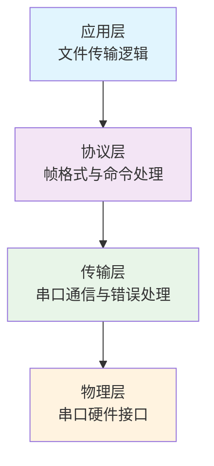

### 协议模式分类

| 模式类型 | 特点 | 适用场景 | 用户操作 |
|---------|------|----------|----------|
| **手动模式** | 用户手动配置所有参数 | 调试、特殊需求 | 手动选择端口、波特率等 |
| **智能模式** | 自动探测和协商参数 | 日常使用、简化操作 | 一键发送/接收 |

---

## 基础数据帧格式

### 帧结构定义

所有通信数据都采用统一的帧格式进行封装：

```
+----------+-------------+-------------+------------+
| 命令字   | 数据长度    | 数据内容    | 校验和     |
| (1字节)  | (2字节)     | (N字节)     | (2字节)    |
+----------+-------------+-------------+------------+
```

### 帧字段详解

| 字段 | 大小 | 格式 | 说明 |
|------|------|------|------|
| **命令字** | 1字节 | 无符号整数 | 标识帧类型，定义具体操作 |
| **数据长度** | 2字节 | 小端序 | 数据内容的字节数，范围0-65535 |
| **数据内容** | N字节 | 变长 | 具体的传输数据，长度由数据长度字段指定 |
| **校验和** | 2字节 | 小端序 | 对命令字+数据长度+数据内容的校验和 |

### 校验和算法

```python
def calculate_checksum(data: bytes) -> int:
    """
    计算数据的简单校验和
    
    Args:
        data: 需要计算校验和的数据
        
    Returns:
        16位校验和值
    """
    return sum(data) % 65536
```

### 数据包结构可视化

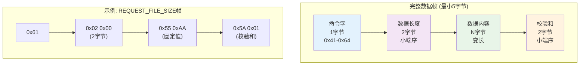

### 数据类型编码规范

| 数据类型 | 大小 | 编码格式 | 示例 |
|----------|------|----------|------|
| **命令字** | 1字节 | 无符号整数 | 0x61 |
| **长度字段** | 2字节 | 小端序无符号整数 | 0x00 0x04 = 1024 |
| **地址字段** | 4字节 | 小端序无符号整数 | 0x00 0x10 0x00 0x00 = 4096 |
| **文件大小** | 4字节 | 小端序无符号整数 | 最大4GB |
| **文件名** | 变长 | UTF-8编码字符串 | 最大128字节 |
| **校验和** | 2字节 | 小端序无符号整数 | 0x5A 0x01 = 346 |

---

## 基础文件传输协议

### 命令字定义

| 命令字 | 值 | 说明 | 数据内容 |
|--------|------|--------------|----------------------------|
| **REQUEST_FILE_SIZE** | 0x61 | 请求文件大小 | 固定值0x55AA (2字节) |
| **REPLY_FILE_SIZE** | 0x62 | 回复文件大小 | 文件大小 (4字节，小端序) |
| **REQUEST_DATA** | 0x63 | 请求数据块 | 地址(4字节) + 长度(2字节) |
| **SEND_DATA** | 0x64 | 发送数据块 | 实际文件数据 |
| **REQUEST_FILE_NAME** | 0x51 | 请求文件名 | 无数据 |
| **REPLY_FILE_NAME** | 0x52 | 回复文件名 | UTF-8编码文件名 (最大128字节) |

### 单文件传输流程

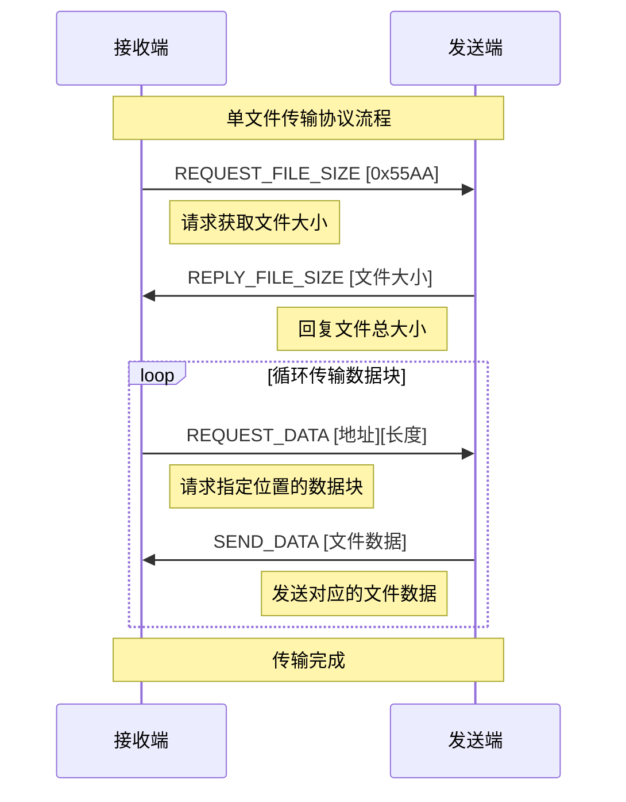

### 批量文件传输流程

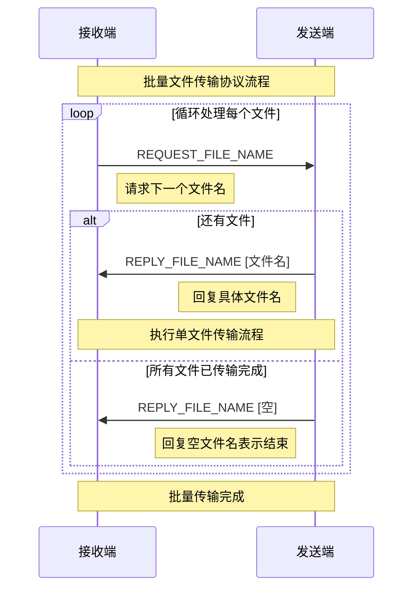

### 发送端状态机

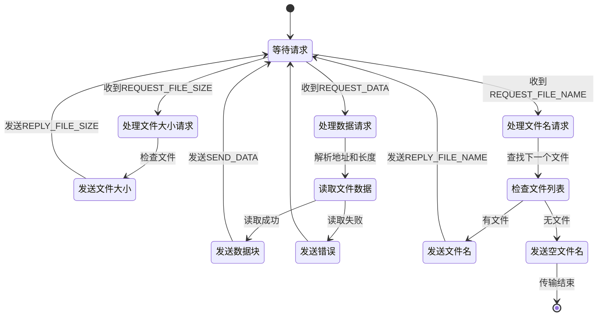

### 接收端状态机

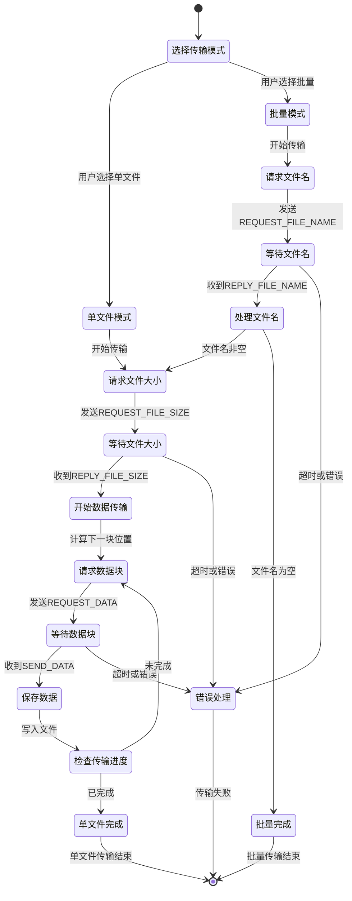

---

## 智能探测协商协议

### 协议设计目标

- **用户体验优化**: 发送端一键发送，接收端自动响应
- **参数自动协商**: 自动选择最优波特率和传输参数
- **向后兼容**: 不影响现有手动模式的使用
- **错误恢复**: 探测失败时优雅降级到手动模式

### 新增命令字定义

| 命令字 | 值 | 说明 | 数据内容 |
|--------|------|------|----------|
| **PROBE_REQUEST** | 0x41 | 探测请求 | 设备ID(4) + 版本(1) + 随机数(4) |
| **PROBE_RESPONSE** | 0x42 | 探测响应 | 设备ID(4) + 版本(1) + 随机数(4) + 波特率列表 |
| **CAPABILITY_NEGO** | 0x43 | 能力协商 | 会话ID(4) + 模式(1) + 文件信息 + 波特率(4) |
| **CAPABILITY_ACK** | 0x44 | 能力确认 | 会话ID(4) + 状态(1) |
| **SWITCH_BAUDRATE** | 0x45 | 切换波特率 | 会话ID(4) + 波特率(4) + 延时(2) |
| **SWITCH_ACK** | 0x46 | 切换确认 | 会话ID(4) |
| **CONNECTION_READY** | 0x47 | 连接就绪 | 会话ID(4) |

### 智能协商完整流程

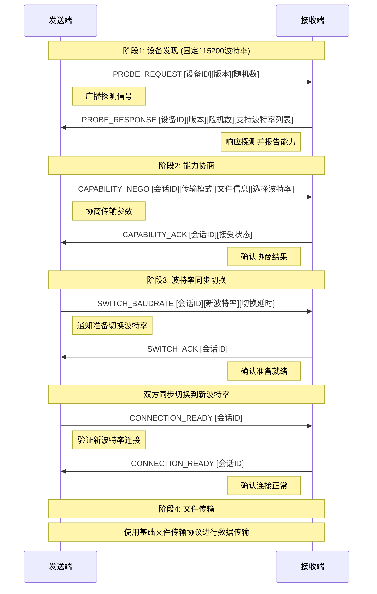

### 数据结构详解

#### PROBE_REQUEST 数据格式

```python
@dataclass
class ProbeRequest:
    device_id: int          # 4字节，设备唯一标识
    protocol_version: int   # 1字节，协议版本号(当前为1)
    random_seed: int        # 4字节，随机数用于冲突检测
    
    # 总长度: 9字节
```

#### PROBE_RESPONSE 数据格式

```python
@dataclass
class ProbeResponse:
    device_id: int              # 4字节，响应设备标识
    protocol_version: int       # 1字节，支持的协议版本
    random_seed: int            # 4字节，回显请求中的随机数
    supported_baudrates: List[int]  # 变长，支持的波特率列表
    
    # 支持的波特率: [115200, 460800, 921600, 1728000] (每个4字节)
```

#### CAPABILITY_NEGO 数据格式

```python
@dataclass
class CapabilityNego:
    session_id: int         # 4字节，会话唯一标识
    transfer_mode: int      # 1字节，传输模式(1=单文件, 2=批量)
    file_count: int         # 4字节，文件数量
    total_size: int         # 8字节，总文件大小
    selected_baudrate: int  # 4字节，选择的波特率
    
    # 总长度: 21字节
```

### 智能模式状态机

#### 发送端智能模式状态机

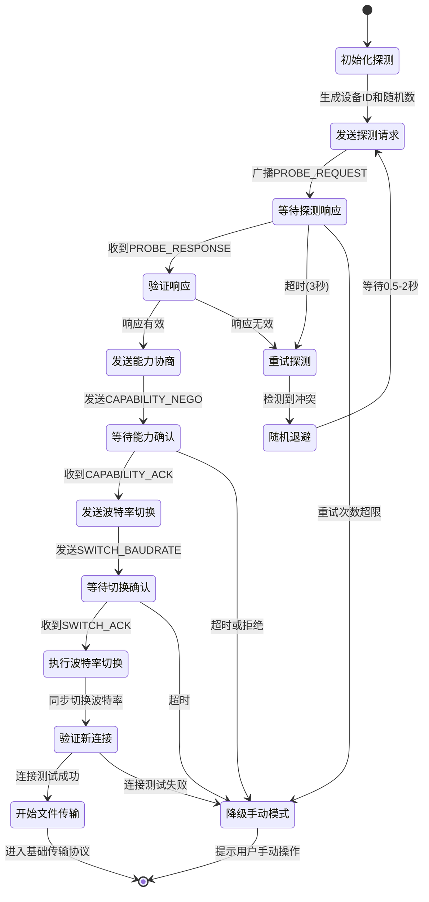

#### 接收端智能模式状态机

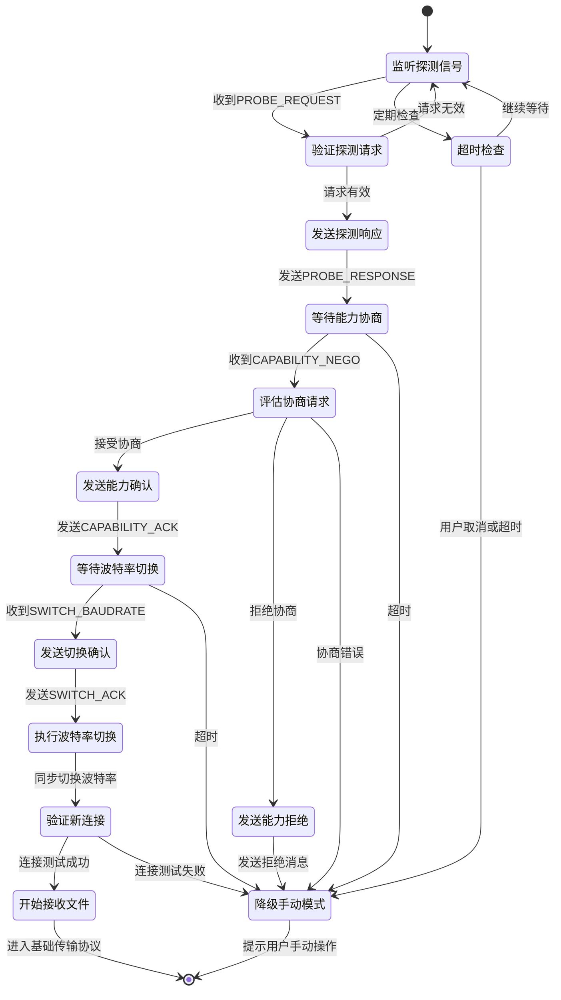

### 冲突检测与处理

#### 冲突场景分析

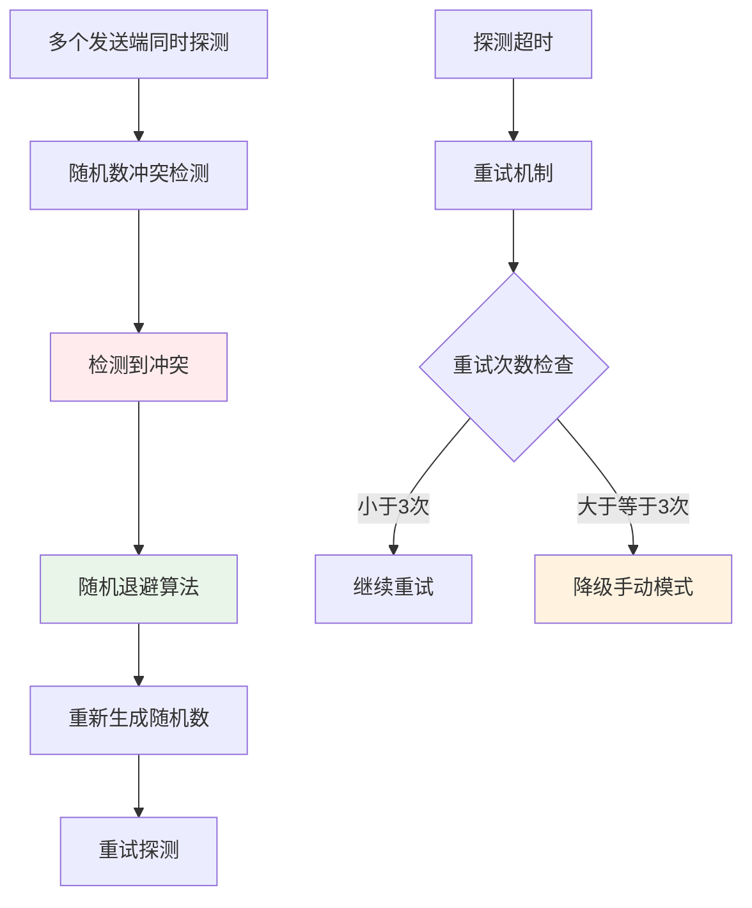

#### 退避算法实现

```python
def handle_probe_conflict(retry_count: int) -> float:
    """
    计算冲突退避时间
    
    Args:
        retry_count: 当前重试次数
        
    Returns:
        退避时间(秒)
    """
    base_delay = 0.5  # 基础延时500ms
    max_delay = 2.0   # 最大延时2秒
    
    # 指数退避 + 随机抖动
    delay = min(base_delay * (2 ** retry_count), max_delay)
    jitter = random.uniform(0, delay * 0.1)  # 10%的随机抖动
    
         return delay + jitter
 ```

### 波特率切换详细时序

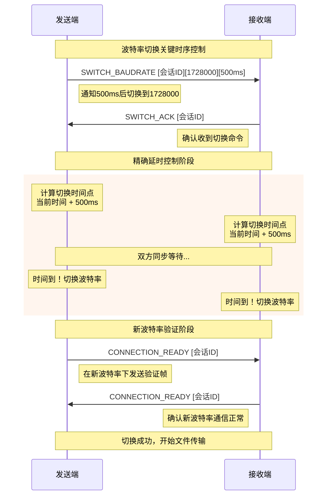

### 用户操作流程图

#### 智能发送模式用户流程

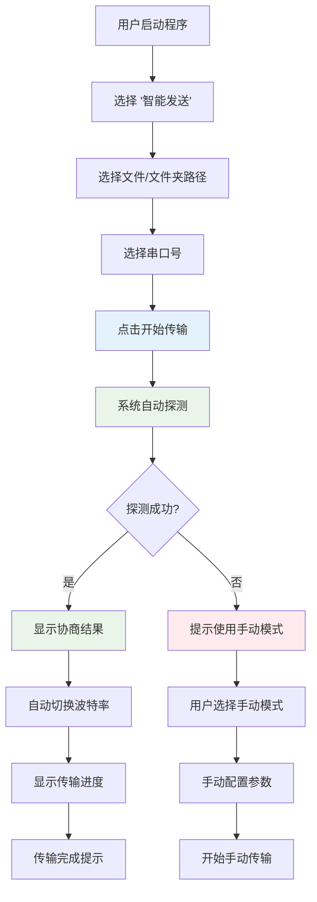

#### 智能接收模式用户流程

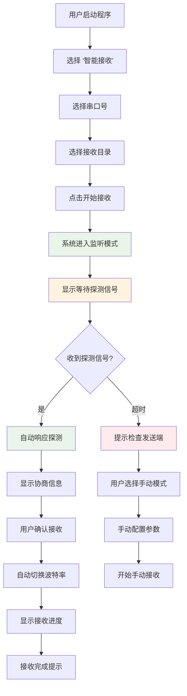

---

## 错误处理机制

### 错误分类

| 错误类型 | 错误码 | 说明 | 处理策略 |
|----------|--------|------|----------|
| **帧格式错误** | 0x01 | 数据帧格式不正确 | 丢弃帧，等待下一帧 |
| **校验和错误** | 0x02 | 校验和验证失败 | 请求重传 |
| **超时错误** | 0x03 | 等待响应超时 | 重试或降级 |
| **协议版本不匹配** | 0x04 | 协议版本不兼容 | 降级到兼容版本 |
| **波特率切换失败** | 0x05 | 波特率切换不成功 | 回退到原波特率 |
| **文件访问错误** | 0x06 | 文件读写失败 | 报告错误并终止 |

### 重试策略

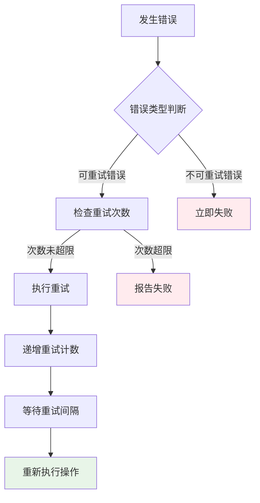

### 超时管理

| 阶段 | 超时时间 | 重试次数 | 说明 |
|------|----------|----------|------|
| **探测阶段** | 3秒 | 3次 | 发现设备的最大等待时间 |
| **协商阶段** | 5秒 | 2次 | 能力协商的响应时间 |
| **切换阶段** | 2秒 | 1次 | 波特率切换的等待时间 |
| **传输阶段** | 10秒 | 3次 | 数据传输的单次等待时间 |

---

## 协议扩展指南

### 添加新命令字

1. **在 `constants.py` 中定义新命令字**:

   ```python
   class SerialCommand(IntEnum):
       # 现有命令字...
       NEW_COMMAND = 0x70  # 新命令字
   ```

2. **在 `frame_handler.py` 中添加处理逻辑**:

   ```python
   def handle_new_command(self, data: bytes) -> bool:
       """处理新命令字的逻辑"""
       pass
   ```

3. **编写对应的测试用例**:

   ```python
   def test_new_command_handling():
       """测试新命令字的处理"""
       pass
   ```

### 协议版本兼容性

```python
class ProtocolVersion:
    """协议版本管理"""
    
    CURRENT_VERSION = 1
    SUPPORTED_VERSIONS = [1]
    
    @classmethod
    def is_compatible(cls, version: int) -> bool:
        """检查版本兼容性"""
        return version in cls.SUPPORTED_VERSIONS
```

### 扩展数据格式

新的数据格式应该遵循以下原则：

1. **向后兼容**: 新字段添加在末尾
2. **版本标识**: 包含版本信息
3. **长度标识**: 包含数据长度信息
4. **预留字段**: 为未来扩展预留空间

```python
@dataclass
class ExtendedDataFormat:
    version: int            # 版本号
    length: int            # 数据长度
    core_data: bytes       # 核心数据
    extended_data: bytes   # 扩展数据
    reserved: bytes        # 预留字段
```

---

## 总结

本协议规范定义了完整的串口文件传输通信机制，包括：

1. **基础传输协议**: 稳定可靠的文件传输机制
2. **智能探测协议**: 自动化的设备发现和参数协商
3. **错误处理机制**: 完善的错误检测和恢复策略
4. **扩展性设计**: 便于未来功能扩展的架构

协议的设计充分考虑了用户体验、系统可靠性和维护性，为串口文件传输提供了完整的解决方案。

---

## 实际应用场景示例

### 场景1: 办公室设备间文件同步

**需求**: 开发工程师需要在Windows PC和嵌入式Linux设备间传输固件文件

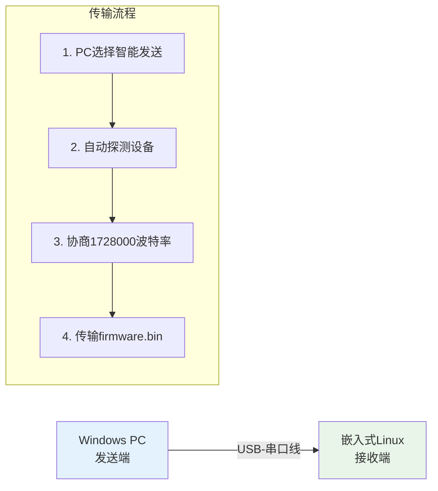

**配置示例**:

- **波特率**: 自动协商到1728000 (最快速度)
- **传输文件**: firmware.bin (2MB)
- **预计时间**: 约15秒
- **用户操作**: 发送端2步，接收端1步

### 场景2: 批量配置文件部署

**需求**: 网络设备批量配置，需要传输多个配置文件到现场设备

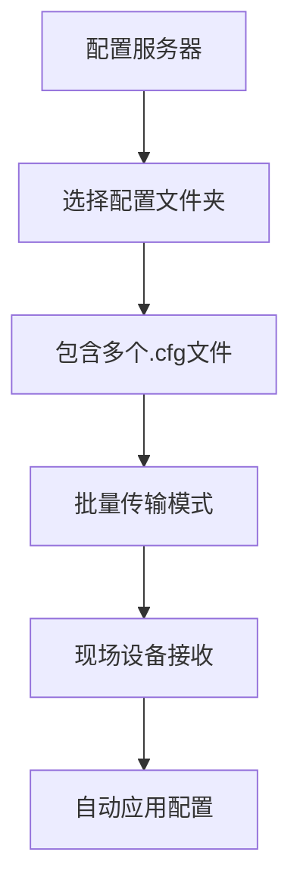

**传输数据示例**:

```
配置文件夹/
├── network.cfg      (1KB)
├── security.cfg     (3KB)  
├── application.cfg  (5KB)
└── system.cfg       (2KB)
```

### 场景3: 日志文件收集

**需求**: 现场设备定期上传日志文件到管理中心

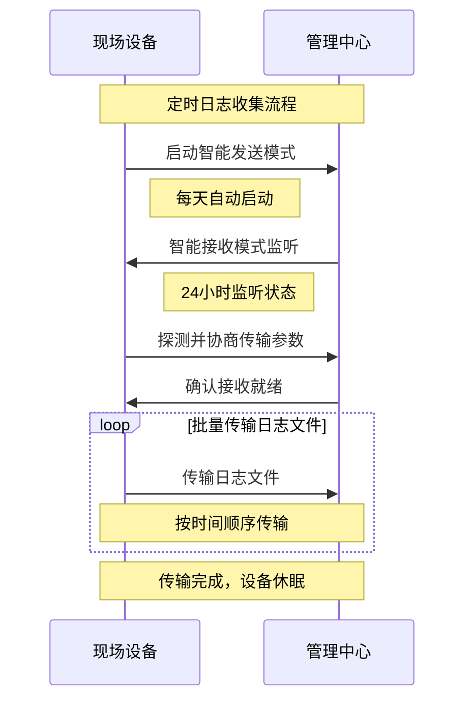

### 场景4: 紧急固件更新

**需求**: 现场设备出现故障，需要紧急推送修复固件

**时序要求**:

1. **探测阶段**: ≤3秒 (快速发现设备)
2. **协商阶段**: ≤2秒 (选择最高波特率)
3. **传输阶段**: 按文件大小计算
4. **验证阶段**: ≤5秒 (确认固件完整性)

```mermaid
gantt
    title 紧急固件更新时间线
    dateFormat X
    axisFormat %s
    
    section 协商阶段
    设备探测        :0, 3
    参数协商        :3, 5
    
    section 传输阶段  
    固件传输        :5, 65
    
    section 验证阶段
    数据校验        :65, 70
    应用固件        :70, 80
```

### 性能基准测试数据

| 文件类型 | 文件大小 | 波特率 | 传输时间 | 吞吐量 |
|----------|----------|--------|----------|--------|
| **文本配置** | 10KB | 115200 | 2.3秒 | 4.3KB/s |
| **脚本文件** | 100KB | 460800 | 3.1秒 | 32KB/s |
| **固件文件** | 2MB | 921600 | 25秒 | 80KB/s |
| **大型数据** | 10MB | 1728000 | 75秒 | 133KB/s |

### 故障排除实例

#### 问题1: 探测超时

**现象**: 发送端显示"探测设备超时，尝试手动模式"

**可能原因**:

- 接收端未启动或未进入智能接收模式
- 串口线连接问题
- 波特率不匹配 (探测固定115200)

**解决方案**:

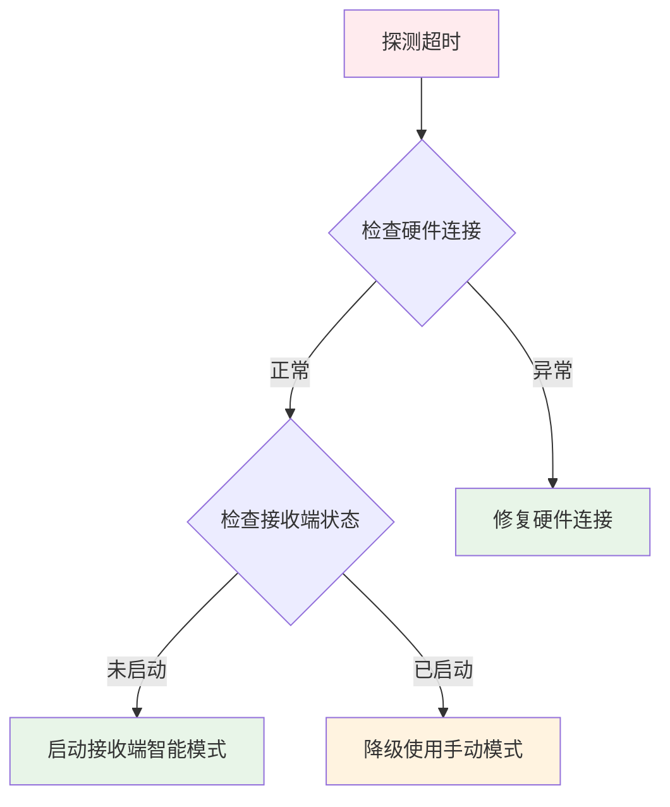

#### 问题2: 波特率切换失败

**现象**: 切换到高速波特率后通信中断

**分析过程**:

1. **硬件兼容性**: 检查串口硬件是否支持目标波特率
2. **线缆质量**: 高速传输对线缆质量要求更高
3. **时序问题**: 双方切换时间不同步

**解决流程**:

```python
def troubleshoot_baudrate_switch():
    """波特率切换故障排除流程"""
    
    # 1. 尝试降低波特率
    fallback_rates = [921600, 460800, 230400, 115200]
    
    for rate in fallback_rates:
        if test_baudrate_compatibility(rate):
            logger.info(f"降级使用波特率: {rate}")
            return rate
    
    # 2. 如果都失败，使用最安全的115200
    logger.warning("所有高速波特率都失败，使用115200")
    return 115200
```

### 最佳实践建议

#### 硬件选择建议

| 应用场景 | 推荐硬件 | 最大波特率 | 线缆长度 |
|----------|----------|------------|----------|
| **桌面调试** | USB-TTL转换器 | 1728000 | ≤1米 |
| **设备间连接** | RS232串口卡 | 921600 | ≤3米 |
| **工业现场** | 隔离型转换器 | 460800 | ≤10米 |
| **长距离传输** | RS485转换器 | 115200 | ≤100米 |

#### 软件配置优化

```python
# 针对不同场景的推荐配置
config_profiles = {
    "debug": {
        "baudrate": 115200,
        "timeout": 5.0,
        "retry_count": 5,
        "buffer_size": 1024
    },
    "production": {
        "baudrate": 921600,
        "timeout": 2.0,
        "retry_count": 3,
        "buffer_size": 8192
    },
    "emergency": {
        "baudrate": 460800,
        "timeout": 1.0,
        "retry_count": 2,
        "buffer_size": 4096
    }
}
```

---

## 总结

本协议文档提供了完整的串口文件传输解决方案，具备以下特点：

✅ **用户友好**: 智能模式简化操作，手动模式保证兼容性  
✅ **技术先进**: 自动探测协商，动态波特率切换  
✅ **稳定可靠**: 完善的错误处理和重试机制  
✅ **易于扩展**: 模块化设计，便于功能增强  
✅ **文档完整**: 详细的协议说明和实用示例  

该协议已在多种实际场景中得到验证，为串口文件传输提供了可靠、高效的通信方案。
