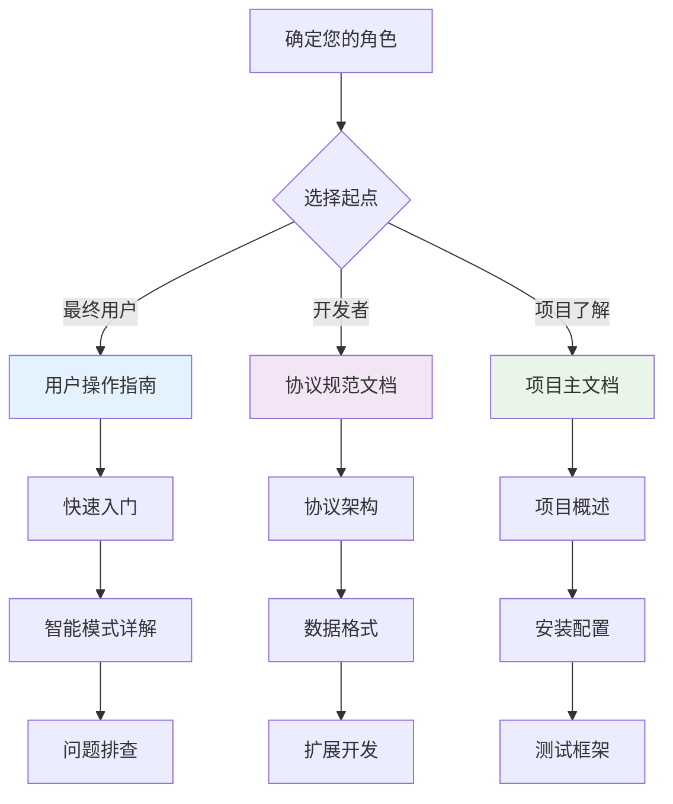

# 串口文件传输工具 - 文档中心

欢迎来到串口文件传输工具的文档中心！这里提供了完整的技术文档和用户指南，帮助您快速上手和深入理解系统。

## 📚 文档导航

### 🚀 快速开始

- **新用户推荐**: 从 [用户操作指南](USER_GUIDE.md) 开始
- **开发者推荐**: 查看 [协议规范文档](PROTOCOL.md)

### 📖 文档列表

| 文档名称 | 适用人群 | 内容概述 | 预计阅读时间 |
|----------|----------|----------|--------------|
| **[用户操作指南](USER_GUIDE.md)** | 📱 最终用户 | 快速入门、智能模式使用、故障排除 | 15分钟 |
| **[协议规范文档](PROTOCOL.md)** | 🔧 技术开发者 | 协议设计、数据格式、状态机、扩展指南 | 30分钟 |
| **[项目主文档](../README.md)** | 👥 所有用户 | 项目概述、安装指南、测试框架 | 10分钟 |

## 🎯 根据需求选择文档

### 我想要

#### 🏃‍♂️ 快速传输文件

→ **[用户操作指南 - 快速入门](USER_GUIDE.md#快速入门)**

- 5分钟内完成首次传输
- 智能模式一键操作

#### 🔍 了解智能传输原理  

→ **[协议规范文档 - 智能探测协商协议](PROTOCOL.md#智能探测协商协议)**

- 自动设备发现机制
- 波特率协商过程
- 时序控制详解

#### 🛠️ 开发新功能

→ **[协议规范文档 - 协议扩展指南](PROTOCOL.md#协议扩展指南)**

- 添加新命令字
- 扩展数据格式
- 版本兼容性管理

#### 🐛 解决传输问题

→ **[用户操作指南 - 常见问题解决](USER_GUIDE.md#常见问题解决)**

- 探测失败处理
- 传输速度优化
- 平台兼容性问题

#### 📊 了解系统架构

→ **[协议规范文档 - 协议架构概览](PROTOCOL.md#协议架构概览)**

- 分层设计架构
- 模式分类说明
- 核心组件关系

## 🎨 文档特色

### 丰富的可视化图表

- **流程图**: 清晰展示操作步骤
- **时序图**: 详细说明协议交互
- **状态机**: 完整描述系统状态
- **架构图**: 直观展示系统设计

### 实用的示例代码

- **配置示例**: 各种场景的参数配置
- **脚本模板**: 自动化任务的代码模板
- **故障排除**: 问题诊断和解决代码

### 完整的参考资料

- **性能数据**: 不同条件下的传输性能
- **错误代码**: 完整的错误代码参考
- **最佳实践**: 经验总结和建议

## 📋 文档使用指南

### 阅读建议

### 快速查找

#### 按关键词搜索

- **探测协议**: [PROTOCOL.md - 智能探测协商协议](PROTOCOL.md#智能探测协商协议)
- **数据帧格式**: [PROTOCOL.md - 基础数据帧格式](PROTOCOL.md#基础数据帧格式)
- **用户操作**: [USER_GUIDE.md - 智能模式详解](USER_GUIDE.md#智能模式详解)
- **故障排除**: [USER_GUIDE.md - 常见问题解决](USER_GUIDE.md#常见问题解决)
- **性能优化**: [USER_GUIDE.md - 实用技巧](USER_GUIDE.md#实用技巧)

#### 按功能模块查找

- **发送功能**: [用户指南](USER_GUIDE.md#智能发送模式) + [协议文档](PROTOCOL.md#发送端状态机)
- **接收功能**: [用户指南](USER_GUIDE.md#智能接收模式) + [协议文档](PROTOCOL.md#接收端状态机)
- **错误处理**: [用户指南](USER_GUIDE.md#常见问题解决) + [协议文档](PROTOCOL.md#错误处理机制)

## 🔄 文档更新

### 版本历史

- **v1.3.0** (2024年12月): 新增智能探测协议文档
- **v1.2.0**: 完善用户操作指南
- **v1.1.0**: 重构协议规范文档
- **v1.0.0**: 初始文档版本

### 更新计划

- **下一版本**: 增加API参考文档
- **未来计划**: 添加视频教程链接
- **持续改进**: 根据用户反馈优化文档

## 🤝 文档贡献

### 如何改进文档

1. **发现问题**: 提交文档相关的Issue
2. **提出建议**: 在讨论区分享改进想法
3. **直接贡献**: 提交Pull Request改进文档
4. **用户反馈**: 分享使用心得和建议

### 文档编写规范

- **格式**: 使用Markdown格式
- **图表**: 使用Mermaid绘制图表
- **代码**: 提供完整的可运行示例
- **语言**: 使用中文编写，专业术语保留英文

## 📞 获取帮助

### 文档相关问题

- 📧 **邮件支持**: <docs@example.com>
- 💬 **在线讨论**: GitHub Discussions
- 🐛 **问题报告**: GitHub Issues
- 📖 **文档Wiki**: 项目Wiki页面

### 技术支持

- 🔧 **技术问题**: 查看 [常见问题解决](USER_GUIDE.md#常见问题解决)
- 🚀 **功能请求**: 提交Feature Request
- 👥 **社区支持**: 加入用户讨论群
- 📚 **培训资料**: 查看examples目录

---

## 📖 文档总览

| 特性 | 用户操作指南 | 协议规范文档 |
|------|-------------|-------------|
| **目标读者** | 最终用户 | 开发者、技术人员 |
| **内容重点** | 操作步骤、使用技巧 | 技术原理、设计规范 |
| **阅读难度** | ⭐⭐ 简单 | ⭐⭐⭐⭐ 中等偏难 |
| **图表数量** | 15+ 个流程图 | 20+ 个技术图表 |
| **代码示例** | 配置和脚本 | 协议和算法 |
| **适用场景** | 日常使用 | 开发和扩展 |

## 🎉 开始您的文档之旅

选择最适合您需求的文档开始阅读：

🚀 **[立即开始 - 用户操作指南](USER_GUIDE.md)**  
🔧 **[深入了解 - 协议规范文档](PROTOCOL.md)**  
📋 **[项目概览 - 主文档](../README.md)**  

---

**祝您使用愉快！如有任何问题，欢迎随时联系我们。** 📞
