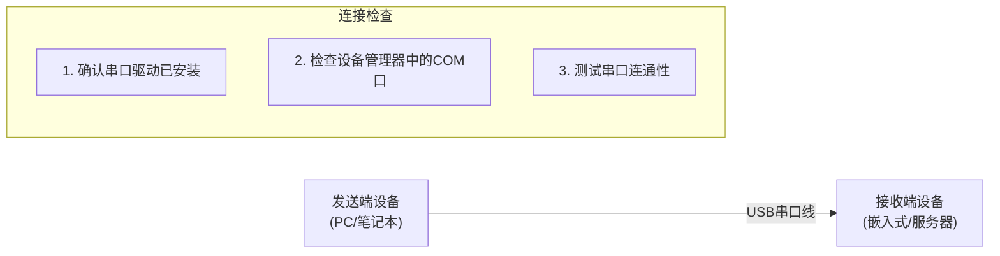
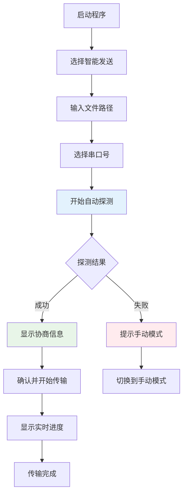
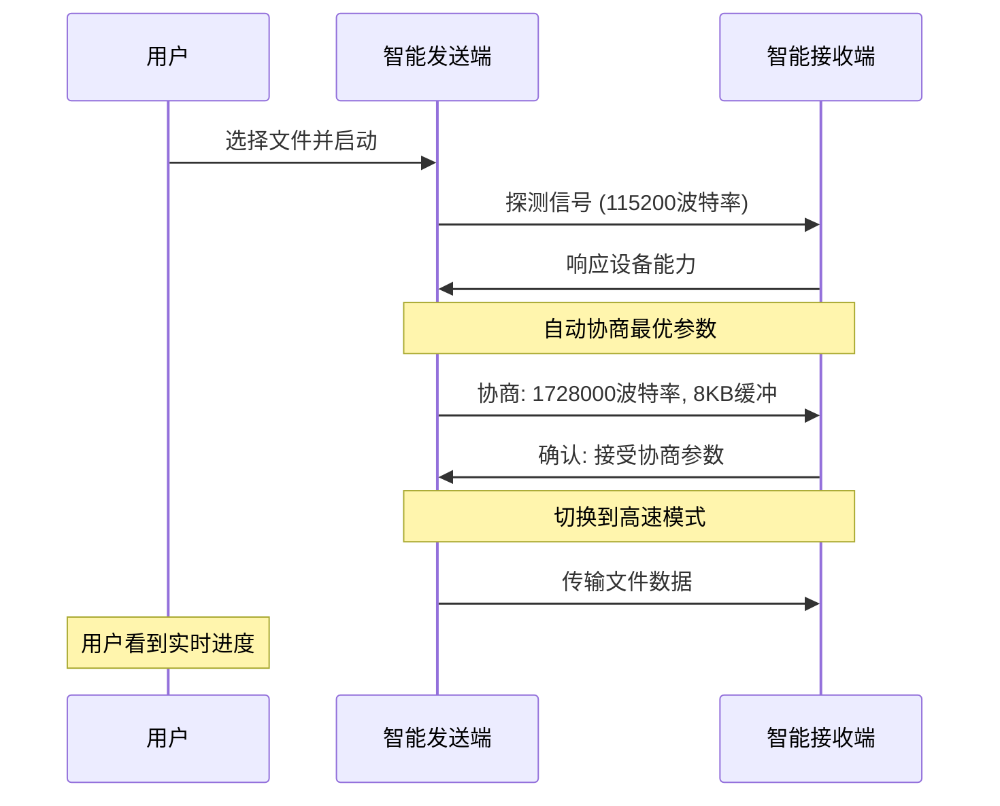
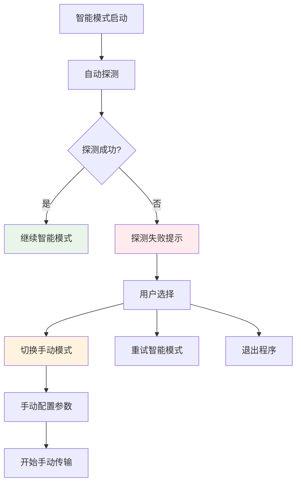
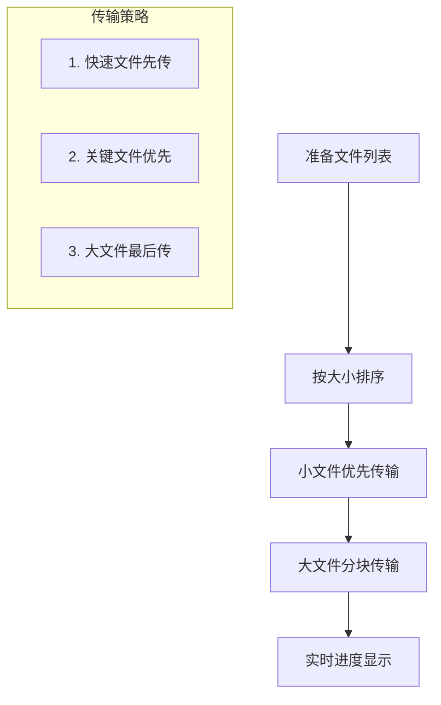
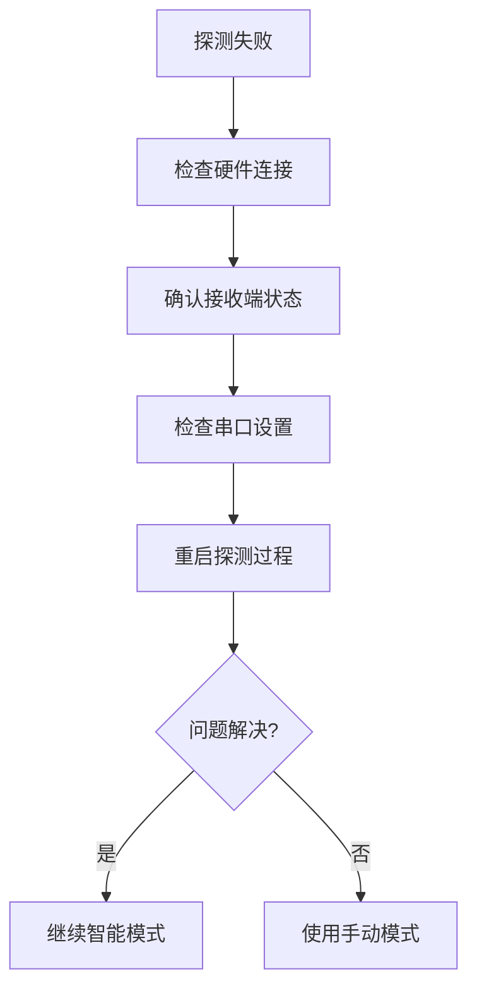
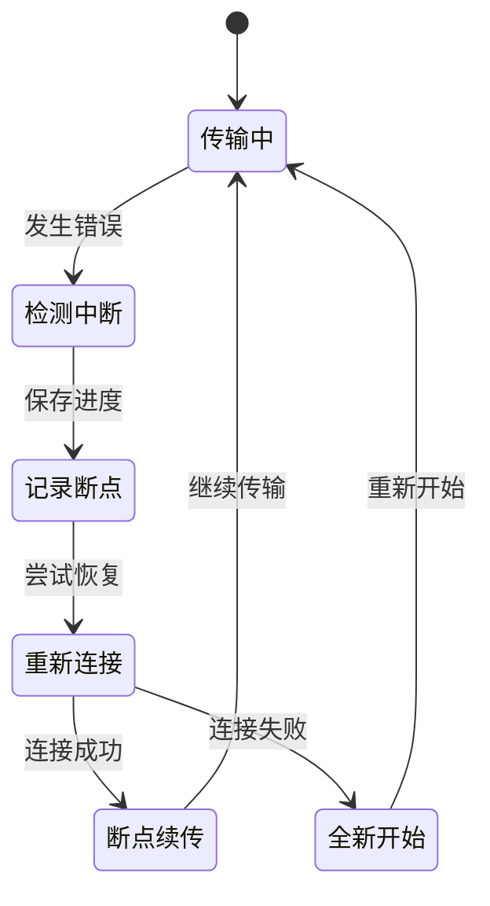

# 串口文件传输工具 - 用户操作指南

## 文档简介

本指南将帮助您快速掌握串口文件传输工具的使用方法，特别是全新的**智能传输模式**。智能模式可以自动完成设备发现、参数协商和波特率优化，让文件传输变得简单高效。

**推荐阅读顺序**:

1. 新用户 → [快速入门](#快速入门)
2. 高级用户 → [智能模式详解](#智能模式详解)  
3. 故障排除 → [常见问题](#常见问题解决)

---

## 快速入门

### 环境准备

#### 1. 安装软件

```bash
# 下载项目代码
git clone https://github.com/your-repo/serial-file-transfer.git
cd serial-file-transfer

# 安装依赖
pip install -r requirements.txt
```

#### 2. 硬件连接



#### 3. 五分钟上手示例

**发送端操作** (Windows PC):

```bash
# 启动程序
python main.py

# 选择菜单选项
请选择操作：
1. 智能发送文件/文件夹 ✨ (推荐)  ← 选择这个
2. 智能接收文件 ✨ (推荐)
...

# 按提示输入
请输入文件/文件夹路径: D:\firmware\update.bin
请选择串口号 (COM3): COM3
开始智能传输...
```

**接收端操作** (Linux 设备):

```bash
# 启动程序  
python main.py

# 选择菜单选项
请选择操作：
1. 智能发送文件/文件夹 ✨ (推荐)
2. 智能接收文件 ✨ (推荐)  ← 选择这个
...

# 按提示输入
请选择串口号 (/dev/ttyUSB0): /dev/ttyUSB0
请输入接收目录 (/tmp): /tmp
开始智能接收模式，等待发送端...
```

---

## 智能模式详解

### 智能发送模式

智能发送模式可以自动检测文件类型、优化传输参数，并处理各种异常情况。

#### 操作界面流程



#### 支持的文件类型

| 文件类型 | 自动识别 | 传输方式 | 示例 |
|----------|----------|----------|------|
| **单个文件** | ✅ | 单文件模式 | firmware.bin, config.xml |
| **文件夹** | ✅ | 批量模式 | logs/, configs/ |
| **大文件** | ✅ | 分块传输 | video.mp4 (>100MB) |
| **多文件** | ✅ | 批量队列 | *.log,*.cfg |

#### 智能参数协商



### 智能接收模式

智能接收模式可以自动监听探测信号，无需手动配置复杂参数。

#### 操作要点

1. **启动监听**: 进入智能接收模式后，程序自动在115200波特率下监听
2. **自动响应**: 收到发送端探测信号后，自动回复设备能力
3. **参数协商**: 自动选择双方都支持的最高波特率
4. **文件接收**: 切换到高速模式后开始接收文件

#### 状态指示说明

```
智能接收模式状态显示：

🔍 [等待探测] 正在115200波特率监听探测信号...
📡 [发现设备] 检测到发送端，设备ID: 0x12345678
⚡ [协商参数] 协商波特率: 1728000, 缓冲区: 8192字节
🔄 [切换波特率] 切换到高速模式...
📥 [接收文件] 接收: firmware.bin (2048KB/2048KB)
✅ [传输完成] 文件保存到: /tmp/firmware.bin
```

### 混合模式使用

如果智能模式遇到问题，系统会自动提示降级到手动模式：



---

## 实用技巧

### 1. 波特率选择指南

| 应用场景 | 推荐波特率 | 传输速度 | 适用距离 |
|----------|------------|----------|----------|
| **桌面调试** | 1728000 | 最快 | ≤1米 |
| **设备互联** | 921600 | 快速 | ≤3米 |
| **工业现场** | 460800 | 稳定 | ≤10米 |
| **长距离** | 115200 | 可靠 | ≤100米 |

### 2. 文件传输性能优化

#### 大文件传输建议

```python
# 对于大文件(>10MB)的优化设置
优化配置 = {
    "缓冲区大小": "8192字节",    # 提高传输效率
    "超时时间": "30秒",         # 避免误判超时
    "重试次数": "5次",          # 增加容错能力
    "分块大小": "1024字节"      # 平衡速度和稳定性
}
```

#### 批量文件传输技巧



### 3. 错误处理最佳实践

#### 自动重试机制

```
重试策略：
├── 网络错误 → 立即重试 (最多3次)
├── 超时错误 → 延时重试 (间隔递增)
├── 校验错误 → 重新请求数据块
└── 硬件错误 → 降级到手动模式
```

#### 错误代码参考

| 错误代码 | 错误类型 | 用户操作 |
|----------|----------|----------|
| **E001** | 串口连接失败 | 检查硬件连接和驱动 |
| **E002** | 探测超时 | 确认接收端已启动 |
| **E003** | 波特率切换失败 | 降低波特率重试 |
| **E004** | 文件读写错误 | 检查文件权限 |
| **E005** | 校验和错误 | 检查线缆质量 |

---

## 常见问题解决

### Q1: 智能模式探测失败

**现象**: 发送端显示"探测设备超时，建议使用手动模式"

**解决步骤**:



**详细排查**:

1. **硬件检查**:
   - 串口线是否正确连接
   - 设备管理器中是否识别串口
   - LED指示灯是否正常

2. **软件检查**:
   - 接收端是否已启动智能接收模式
   - 防火墙是否阻止串口访问
   - 其他程序是否占用串口

3. **参数检查**:
   - 确认串口号正确 (Windows: COM1-COM255, Linux: /dev/ttyUSB0等)
   - 确认波特率兼容性

### Q2: 传输速度比预期慢

**分析工具**:

```python
# 性能分析命令
传输性能 = {
    "理论速度": "波特率 ÷ 10",           # 115200 → 11.5KB/s
    "实际速度": "考虑协议开销60-80%",      # 实际约7-9KB/s  
    "优化建议": "提高波特率或减少重传"
}
```

**优化方案**:

- **提高波特率**: 从115200升级到921600或更高
- **减少干扰**: 使用屏蔽线缆，远离干扰源
- **调整缓冲**: 增大缓冲区大小 (1024 → 8192字节)

### Q3: 文件传输中断

**恢复机制**:



**手动恢复步骤**:

1. 记录传输中断时的文件名和位置
2. 重新启动传输程序
3. 选择"断点续传"选项 (如果支持)
4. 从中断位置继续传输

### Q4: 跨平台兼容性问题

**Windows ↔ Linux 传输**:

```python
# 平台差异处理
platform_configs = {
    "Windows": {
        "串口格式": "COM1, COM2, ...",
        "路径分隔符": "\\",
        "换行符": "\\r\\n"
    },
    "Linux": {
        "串口格式": "/dev/ttyUSB0, /dev/ttyS0, ...",
        "路径分隔符": "/", 
        "换行符": "\\n"
    }
}
```

**解决方案**:

- 使用智能模式自动处理平台差异
- 文件路径使用绝对路径避免歧义
- 文件名避免特殊字符和中文

---

## 高级功能

### 1. 自动化脚本

#### 批量传输脚本示例

```python
#!/usr/bin/env python3
"""
自动化文件传输脚本
用于定时传输或批处理场景
"""

from serial_file_transfer.cli.file_transfer import FileTransferCLI
import schedule
import time

def auto_transfer():
    """定时传输函数"""
    file_path = "/path/to/daily_logs/"
    success = FileTransferCLI.smart_send(file_path)
    
    if success:
        print(f"✅ 自动传输成功: {file_path}")
    else:
        print(f"❌ 自动传输失败: {file_path}")

# 每天凌晨2点执行传输
schedule.every().day.at("02:00").do(auto_transfer)

while True:
    schedule.run_pending()
    time.sleep(60)
```

### 2. 配置文件自定义

#### 创建自定义配置

```python
# config/custom_settings.py
CUSTOM_PROFILES = {
    "高速传输": {
        "baudrate": 1728000,
        "timeout": 1.0,
        "buffer_size": 16384,
        "retry_count": 2
    },
    "稳定传输": {
        "baudrate": 460800,
        "timeout": 5.0,
        "buffer_size": 4096,
        "retry_count": 5
    },
    "远程传输": {
        "baudrate": 115200,
        "timeout": 10.0,
        "buffer_size": 1024,
        "retry_count": 10
    }
}
```

### 3. 日志分析

#### 查看传输日志

```bash
# 查看最近的传输记录
tail -f logs/transfer.log

# 分析传输性能
grep "传输完成" logs/transfer.log | tail -10

# 查看错误统计
grep "ERROR" logs/transfer.log | wc -l
```

---

## 安全注意事项

### 1. 数据安全

- ✅ 传输过程中使用校验和验证数据完整性
- ✅ 支持传输进度实时监控
- ⚠️ 不支持数据加密，敏感数据请预先加密

### 2. 设备安全  

- ✅ 自动探测避免参数配置错误
- ✅ 支持传输中断和恢复
- ⚠️ 请确认接收端设备有足够存储空间

### 3. 网络安全

- ✅ 仅支持串口直连，无网络安全风险  
- ✅ 不会泄露设备网络配置信息
- ⚠️ 请勿在公共场所使用，避免设备信息泄露

---

## 联系支持

### 技术支持渠道

- 📚 **文档**: 查看 `docs/PROTOCOL.md` 了解协议详情
- 🐛 **问题反馈**: 提交 GitHub Issue
- 💬 **社区讨论**: 参与项目讨论区
- 📧 **邮件支持**: <support@example.com>

### 贡献代码

欢迎提交改进建议和代码贡献：

1. Fork 项目仓库
2. 创建功能分支
3. 编写测试用例  
4. 提交 Pull Request

### 版本更新

- **当前版本**: v1.3.0
- **下个版本**: v1.4.0 (计划增加GUI界面)
- **更新频率**: 每月定期更新

---

## 快速参考卡片

### 常用命令

```bash
# 启动程序
python main.py

# 直接进入智能发送模式
python main.py --smart-send

# 直接进入智能接收模式  
python main.py --smart-receive

# 查看帮助
python main.py --help
```

### 快捷键

- `Ctrl+C`: 中断传输
- `Ctrl+Z`: 暂停传输 (Linux)
- `Enter`: 确认选择
- `q`: 退出程序

### 状态代码

- 🔍 探测中  
- 📡 已发现
- ⚡ 协商中
- 🔄 切换中
- 📤 发送中
- 📥 接收中  
- ✅ 完成
- ❌ 失败

---

## 总结

通过本用户指南，您应该能够：

✅ **快速上手**: 5分钟内完成首次文件传输  
✅ **掌握智能模式**: 理解自动探测和协商机制  
✅ **解决常见问题**: 独立排查和解决传输问题  
✅ **优化传输性能**: 根据场景选择最佳配置  
✅ **安全使用**: 了解安全注意事项和最佳实践  

智能传输模式让串口文件传输变得**简单、快速、可靠**。如果遇到问题，请参考故障排除章节或联系技术支持。

**祝您使用愉快！** 🚀
